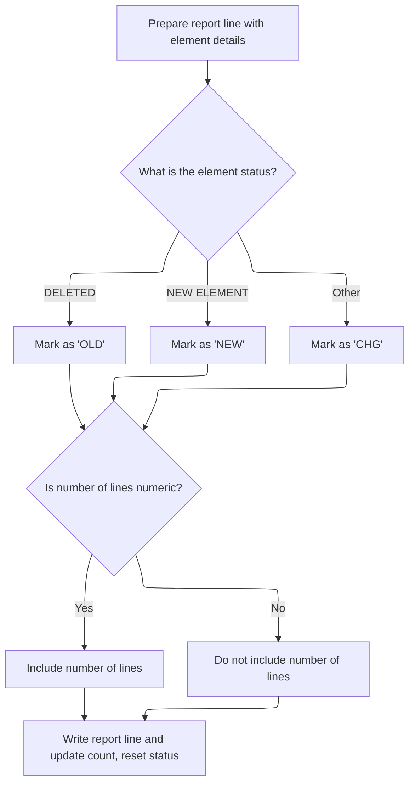
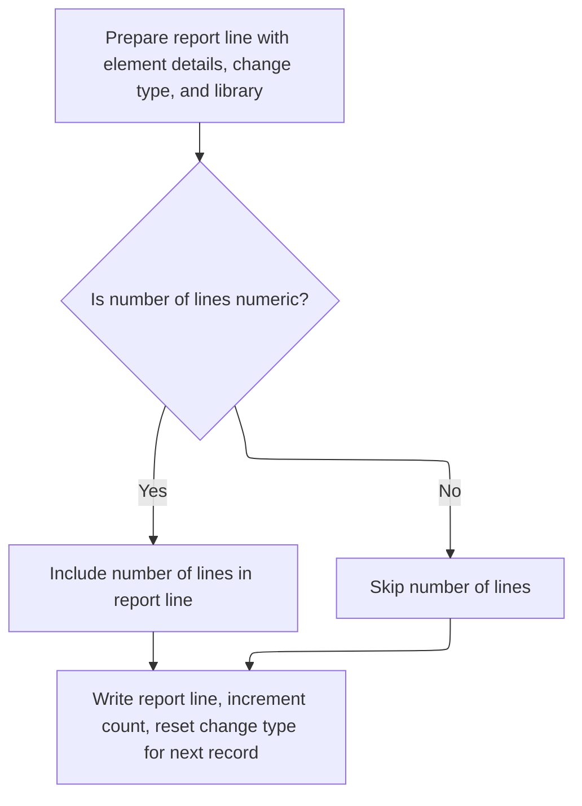

This document explains how the change history report is produced. The flow takes change history data for elements and generates a paginated, line-based report that records each significant change. For each relevant change, the report includes detailed lines for both the current and previous states, ensuring users can track what was changed, added, or deleted.

# Page Break and Report Line Routing

<SwmSnippet path="/PDS/JXC370JX" line="1317">

---

In `Y0300-PRINT-SCHED-HIST-RPT02`, we start by checking if the current report line count exceeds the max lines per page. If so, we call Y0110-SCHEDHST-RPT01-HEADING to print a new page header before continuing. This keeps the report paginated and readable.

```
       Y0300-PRINT-SCHED-HIST-RPT02.

           IF RPT-LINE-CNT > INST-LINES-PER-PAGE
               PERFORM Y0110-SCHEDHST-RPT01-HEADING
                  THRU Y0110-EXIT
           END-IF.
```

---

</SwmSnippet>

<SwmSnippet path="/PDS/JXC370JX" line="1324">

---

Here we check if the change type is 'NEW ELEMENT', 'DELETED', or blank. If so, we jump to Y0300-PRINT-CURRENT to output a detailed report line for that change. This filters which changes get a full report entry.

```
           IF WS-CHANGE-TYPE = 'NEW ELEMENT' OR 'DELETED' OR SPACE
              GO TO Y0300-PRINT-CURRENT
           END-IF.
```

---

</SwmSnippet>

## Detailed Change Line Output



<SwmSnippet path="/PDS/JXC370JX" line="1354">

---

In `Y0300-PRINT-CURRENT`, we prep the detailed report line by moving all the relevant change info (element name, type, level, dates, editor, etc.) into the RPT02-DETAIL-LINE structure. This sets up the data for outputting a full change record.

```
       Y0300-PRINT-CURRENT.

           MOVE SPACES                  TO RPT02-DETAIL-LINE

           MOVE SH-ELEMENT-NAME         TO RPT02-ELEMENT-NAME
           MOVE WS-CHANGE-TYPE          TO RPT02-CHANGE-TYPE
           MOVE SH-ELEMENT-LEVEL        TO RPT02-ELEMENT-LEVEL
           MOVE SH-EDIT-DATE-CYMD       TO RPT02-EDIT-DATE
           MOVE SH-EDIT-TIME            TO RPT02-EDIT-TIME
           MOVE SH-LAST-EDIT-BY         TO RPT02-LAST-EDIT-BY
           MOVE SH-CAPTURE-DATE-CYMD    TO RPT02-PROMOTE-DATE
           MOVE SH-CREATE-DATE-CYMD     TO RPT02-CREATE-DATE

           MOVE 'CHG'                   TO RPT02-OLD-NEW
```

---

</SwmSnippet>

<SwmSnippet path="/PDS/JXC370JX" line="1369">

---

Next we set the 'OLD', 'NEW', or 'CHG' status in the report line based on the change type. This relies on WS-CHANGE-TYPE having the expected values, so if that changes upstream, the report output could get confusing.

```
           IF WS-CHANGE-TYPE =  'DELETED'
              MOVE 'OLD'                   TO RPT02-OLD-NEW
           ELSE
           IF WS-CHANGE-TYPE =  'NEW ELEMENT'
              MOVE 'NEW'                   TO RPT02-OLD-NEW
           ELSE
              MOVE 'CHG'                   TO RPT02-OLD-NEW
           END-IF.
```

---

</SwmSnippet>

<SwmSnippet path="/PDS/JXC370JX" line="1378">

---

Here we only move the number of lines into the report if it's actually numeric, avoiding junk data in the output.

```
           IF SH-NUMBER-LINES NUMERIC
              MOVE SH-NUMBER-LINES      TO RPT02-NUMBER-LINES
           END-IF.
```

---

</SwmSnippet>

<SwmSnippet path="/PDS/JXC370JX" line="1382">

---

Finally we write the filled-out report line to the output file, bump the line count, and clear the change type for the next record.

```
           MOVE SH-ELEMENT-LIB          TO RPT02-ELEMENT-LIB.

           WRITE CHANGE-HIST-RPTREC FROM RPT02-DETAIL-LINE
               AFTER ADVANCING 1 LINE.
           ADD 1 TO RPT-LINE-CNT.

           MOVE SPACE          TO WS-CHANGE-TYPE.
```

---

</SwmSnippet>

## Secondary Change Line Output



<SwmSnippet path="/PDS/JXC370JX" line="1328">

---

Back in Y0300-PRINT-SCHED-HIST-RPT02, after returning from Y0300-PRINT-CURRENT, we prep a second report line using the SH2 (previous state) fields. This gives a before/after view in the report.

```
           MOVE SPACES                  TO RPT02-DETAIL-LINE

           MOVE SH2-ELEMENT-NAME        TO RPT02-ELEMENT-NAME
           MOVE WS-CHANGE-TYPE          TO RPT02-CHANGE-TYPE
           MOVE SH2-ELEMENT-LEVEL       TO RPT02-ELEMENT-LEVEL
           MOVE SH2-CAPTURE-DATE-CYMD   TO RPT02-PROMOTE-DATE

           MOVE SH2-EDIT-DATE-CYMD      TO RPT02-EDIT-DATE
           MOVE SH2-EDIT-TIME           TO RPT02-EDIT-TIME
           MOVE SH2-LAST-EDIT-BY        TO RPT02-LAST-EDIT-BY
           MOVE SH2-CREATE-DATE-CYMD    TO RPT02-CREATE-DATE

           MOVE 'OLD'                   TO RPT02-OLD-NEW
```

---

</SwmSnippet>

<SwmSnippet path="/PDS/JXC370JX" line="1341">

---

Here we only copy the previous state's line count if it's valid, just like we did for the current state.

```
           IF SH2-NUMBER-LINES NUMERIC
              MOVE SH2-NUMBER-LINES     TO RPT02-NUMBER-LINES
           END-IF.
```

---

</SwmSnippet>

<SwmSnippet path="/PDS/JXC370JX" line="1345">

---

Finally we write the previous state line to the report, bump the line count, and clear the change type again.

```
           MOVE SH2-ELEMENT-LIB         TO RPT02-ELEMENT-LIB.

           WRITE CHANGE-HIST-RPTREC FROM RPT02-DETAIL-LINE
               AFTER ADVANCING 1 LINE.
           ADD 1 TO RPT-LINE-CNT.

           MOVE SPACE          TO WS-CHANGE-TYPE.
```

---

</SwmSnippet>

&nbsp;

*This is an auto-generated document by Swimm 🌊 and has not yet been verified by a human*

<SwmMeta version="3.0.0" repo-id="Z2l0aHViJTNBJTNBRWFzeXRyaWV2ZS1DQlQ3MjElM0ElM0FtdWRhc2luMQ==" repo-name="Easytrieve-CBT721"><sup>Powered by [Swimm](https://app.swimm.io/)</sup></SwmMeta>
