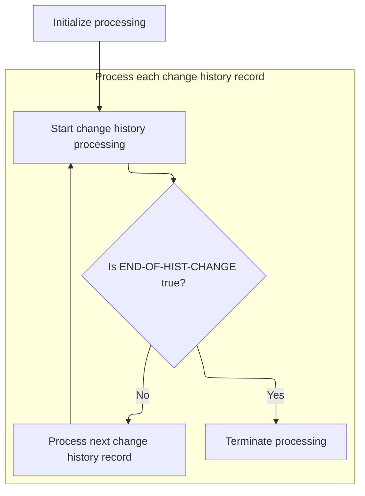
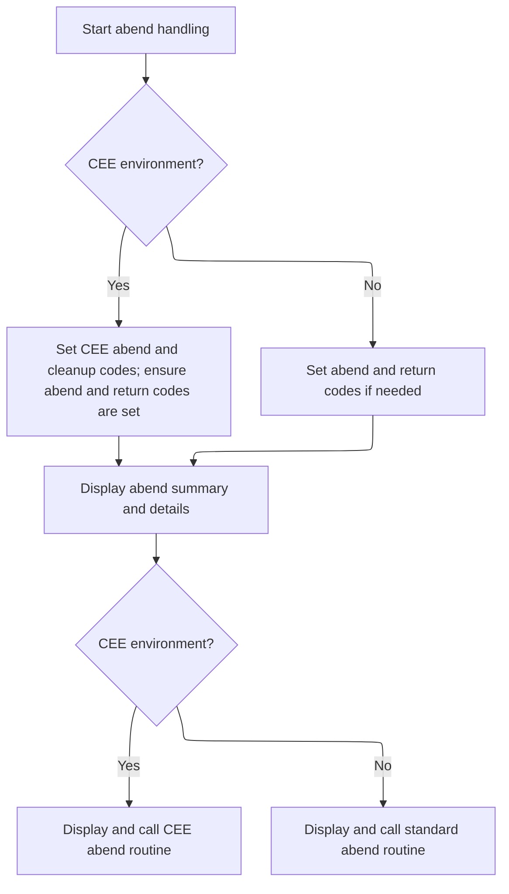

# Overview

This document describes how change history records are processed to produce a date-last-maintained file for each program or copybook element. The flow ensures that only the most recent record for each element is kept, and deleted records are retained only if they meet the retention policy.

## Dependencies

### Program

- <SwmToken path="PDS/JXC320JX" pos="236:6:6" line-data="           DISPLAY &#39;PROGRAM JXC320JX - CREATE A DATE-LAST-MAINT FILE&#39;">`JXC320JX`</SwmToken> (<SwmPath>[PDS/JXC320JX](PDS/JXC320JX)</SwmPath>)

## Input and Output Tables/Files used in the Program

| Table / File Name                                                                                                                                       | Type | Description                                                                                                                                                          | Usage Mode | Key Fields / Layout Highlights |
| ------------------------------------------------------------------------------------------------------------------------------------------------------- | ---- | -------------------------------------------------------------------------------------------------------------------------------------------------------------------- | ---------- | ------------------------------ |
| <SwmToken path="PDS/JXC320JX" pos="264:5:9" line-data="           OPEN INPUT CHANGE-HIST-FILE">`CHANGE-HIST-FILE`</SwmToken>                            | IMS  | Source element change history with edit, promote, and status data                                                                                                    | Input      | Hierarchical segment structure |
| <SwmToken path="PDS/JXC320JX" pos="268:5:7" line-data="               OPEN OUTPUT DEBUG-REPORT.">`DEBUG-REPORT`</SwmToken>                              | IMS  | Debugging output lines for program execution tracing                                                                                                                 | Output     | Hierarchical segment structure |
| <SwmToken path="PDS/JXC320JX" pos="313:7:11" line-data="              ADD 15 TO DEBUG-RPT-LINE-CNT">`DEBUG-RPT-LINE`</SwmToken>                         | IMS  | Single debug report line, written to <SwmToken path="PDS/JXC320JX" pos="268:5:7" line-data="               OPEN OUTPUT DEBUG-REPORT.">`DEBUG-REPORT`</SwmToken> file | Output     | Hierarchical segment structure |
| <SwmToken path="PDS/JXC320JX" pos="411:5:9" line-data="           OPEN INPUT DELETE-DATE-FILE.">`DELETE-DATE-FILE`</SwmToken>                           | IMS  | Control file specifying months of deletes to retain                                                                                                                  | Input      | Hierarchical segment structure |
| <SwmToken path="PDS/JXC320JX" pos="265:5:9" line-data="           OPEN OUTPUT NEW-CHANGE-FILE.">`NEW-CHANGE-FILE`</SwmToken>                            | IMS  | Output file for latest element change history records                                                                                                                | Output     | Hierarchical segment structure |
| <SwmToken path="PDS/JXC320JX" pos="558:3:7" line-data="           WRITE NEW-CHANGE-RECORD FROM SOURCE-HISTORY-RECORD-2.">`NEW-CHANGE-RECORD`</SwmToken> | IMS  | Record for latest change history per element                                                                                                                         | Output     | Hierarchical segment structure |

&nbsp;

# Workflow

# Main Control Flow



This section governs the overall lifecycle of the job, ensuring that initialization occurs before any processing, that each change history record is handled, and that proper termination is performed at the end.

| Category        | Rule Name                 | Description                                                                                                                                                                                                                                                              |
| --------------- | ------------------------- | ------------------------------------------------------------------------------------------------------------------------------------------------------------------------------------------------------------------------------------------------------------------------ |
| Data validation | Mandatory initialization  | Initialization must be performed before any change history processing begins, to ensure all required data and environment settings are in place.                                                                                                                         |
| Business logic  | Change history completion | Processing of change history records must continue until the end-of-history condition is met, as indicated by the <SwmToken path="PDS/JXC320JX" pos="226:3:9" line-data="              UNTIL END-OF-HIST-CHANGE.">`END-OF-HIST-CHANGE`</SwmToken> flag being set to 'Y'. |
| Business logic  | Orderly termination       | Termination steps must be executed after all change history records have been processed, to ensure proper closure and any necessary cleanup.                                                                                                                             |

<SwmSnippet path="/PDS/JXC320JX" line="220">

---

PROCEDURE DIVISION starts the job, calls initialization to get everything ready, then processes change history, and wraps up with termination.

```
       PROCEDURE DIVISION USING JXL-PARM-DATA.

           PERFORM A1000-INITIALIZATION THRU A1000-EXIT.

           PERFORM C1000-PROCESS-CHANGE-HIST
              THRU C1000-EXIT
              UNTIL END-OF-HIST-CHANGE.

           PERFORM A9000-TERMINATION THRU A9000-EXIT.
           GOBACK.
```

---

</SwmSnippet>

# Job Setup and Parameter Handling

```mermaid
%%{init: {"flowchart": {"defaultRenderer": "elk"}} }%%
flowchart TD
    node1["Initialize program: display info, set headings, company, product, dates"]
    click node1 openCode "PDS/JXC320JX:231:245"
    node1 --> node2{"Are input parameters provided?"}
    click node2 openCode "PDS/JXC320JX:305:314"
    node2 -->|"Yes"| node3["Process parameters and set debug/reporting"]
    click node3 openCode "PDS/JXC320JX:305:337"
    node2 -->|"No"| node4["Continue with default settings"]
    click node4 openCode "PDS/JXC320JX:315:318"
    node3 --> node5{"Is debug mode enabled?"}
    click node5 openCode "PDS/JXC320JX:319:337"
    node5 -->|"Yes"| node6["Display debug info and set debug fields"]
    click node6 openCode "PDS/JXC320JX:319:337"
    node5 -->|"No"| node7["Skip debug setup"]
    click node7 openCode "PDS/JXC320JX:338:338"
    node4 --> node7
    node6 --> node8["Calculate delete cutoff date"]
    click node8 openCode "PDS/JXC320JX:348:348"
    node7 --> node8
    node8 --> node9["Apply installation-specific settings"]
    click node9 openCode "PDS/JXC320JX:359:360"
    node9 --> node10["Open input and output files"]
    click node10 openCode "PDS/JXC320JX:368:369"
    node10 --> node11{"Did input file open successfully?"}
    click node11 openCode "PDS/JXC320JX:374:380"
    node11 -->|"No"| node12["Display error and end program"]
    click node12 openCode "PDS/JXC320JX:375:378"
    node12 --> node16["Abnormal end handler (Z9000-ABEND-PROGRAM)"]
    click node16 openCode "PDS/JXC320JX:378:379"
    node11 -->|"Yes"| node13{"Did output file open successfully?"}
    click node13 openCode "PDS/JXC320JX:387:391"
    node13 -->|"No"| node14["Display error and end program"]
    click node14 openCode "PDS/JXC320JX:388:390"
    node14 --> node16
    node13 -->|"Yes"| node17{"Are there records in the change history file?"}
    click node17 openCode "PDS/JXC320JX:382:385"
    node17 -->|"No"| node18["Display 'No records' and end program"]
    click node18 openCode "PDS/JXC320JX:383:384"
    node18 --> node16
    node17 -->|"Yes"| node19["Begin main processing (X1000-READ-CHANGE-HIST)"]
    click node19 openCode "PDS/JXC320JX:380:381"

classDef HeadingStyle fill:#777777,stroke:#333,stroke-width:2px;

%% Swimm:
%% %%{init: {"flowchart": {"defaultRenderer": "elk"}} }%%
%% flowchart TD
%%     node1["Initialize program: display info, set headings, company, product, dates"]
%%     click node1 openCode "<SwmPath>[PDS/JXC320JX](PDS/JXC320JX)</SwmPath>:231:245"
%%     node1 --> node2{"Are input parameters provided?"}
%%     click node2 openCode "<SwmPath>[PDS/JXC320JX](PDS/JXC320JX)</SwmPath>:305:314"
%%     node2 -->|"Yes"| node3["Process parameters and set debug/reporting"]
%%     click node3 openCode "<SwmPath>[PDS/JXC320JX](PDS/JXC320JX)</SwmPath>:305:337"
%%     node2 -->|"No"| node4["Continue with default settings"]
%%     click node4 openCode "<SwmPath>[PDS/JXC320JX](PDS/JXC320JX)</SwmPath>:315:318"
%%     node3 --> node5{"Is debug mode enabled?"}
%%     click node5 openCode "<SwmPath>[PDS/JXC320JX](PDS/JXC320JX)</SwmPath>:319:337"
%%     node5 -->|"Yes"| node6["Display debug info and set debug fields"]
%%     click node6 openCode "<SwmPath>[PDS/JXC320JX](PDS/JXC320JX)</SwmPath>:319:337"
%%     node5 -->|"No"| node7["Skip debug setup"]
%%     click node7 openCode "<SwmPath>[PDS/JXC320JX](PDS/JXC320JX)</SwmPath>:338:338"
%%     node4 --> node7
%%     node6 --> node8["Calculate delete cutoff date"]
%%     click node8 openCode "<SwmPath>[PDS/JXC320JX](PDS/JXC320JX)</SwmPath>:348:348"
%%     node7 --> node8
%%     node8 --> node9["Apply installation-specific settings"]
%%     click node9 openCode "<SwmPath>[PDS/JXC320JX](PDS/JXC320JX)</SwmPath>:359:360"
%%     node9 --> node10["Open input and output files"]
%%     click node10 openCode "<SwmPath>[PDS/JXC320JX](PDS/JXC320JX)</SwmPath>:368:369"
%%     node10 --> node11{"Did input file open successfully?"}
%%     click node11 openCode "<SwmPath>[PDS/JXC320JX](PDS/JXC320JX)</SwmPath>:374:380"
%%     node11 -->|"No"| node12["Display error and end program"]
%%     click node12 openCode "<SwmPath>[PDS/JXC320JX](PDS/JXC320JX)</SwmPath>:375:378"
%%     node12 --> node16["Abnormal end handler (<SwmToken path="PDS/JXC320JX" pos="274:3:7" line-data="               PERFORM Z9000-ABEND-PROGRAM THRU Z9000-EXIT">`Z9000-ABEND-PROGRAM`</SwmToken>)"]
%%     click node16 openCode "<SwmPath>[PDS/JXC320JX](PDS/JXC320JX)</SwmPath>:378:379"
%%     node11 -->|"Yes"| node13{"Did output file open successfully?"}
%%     click node13 openCode "<SwmPath>[PDS/JXC320JX](PDS/JXC320JX)</SwmPath>:387:391"
%%     node13 -->|"No"| node14["Display error and end program"]
%%     click node14 openCode "<SwmPath>[PDS/JXC320JX](PDS/JXC320JX)</SwmPath>:388:390"
%%     node14 --> node16
%%     node13 -->|"Yes"| node17{"Are there records in the change history file?"}
%%     click node17 openCode "<SwmPath>[PDS/JXC320JX](PDS/JXC320JX)</SwmPath>:382:385"
%%     node17 -->|"No"| node18["Display 'No records' and end program"]
%%     click node18 openCode "<SwmPath>[PDS/JXC320JX](PDS/JXC320JX)</SwmPath>:383:384"
%%     node18 --> node16
%%     node17 -->|"Yes"| node19["Begin main processing (<SwmToken path="PDS/JXC320JX" pos="276:3:9" line-data="               PERFORM X1000-READ-CHANGE-HIST THRU X1000-EXIT.">`X1000-READ-CHANGE-HIST`</SwmToken>)"]
%%     click node19 openCode "<SwmPath>[PDS/JXC320JX](PDS/JXC320JX)</SwmPath>:380:381"
%% 
%% classDef HeadingStyle fill:#777777,stroke:#333,stroke-width:2px;
```



This section is responsible for preparing the program to process change history data by setting up all necessary environment variables, parameters, and files. It ensures that the program is correctly configured before any main processing begins, including handling user-provided parameters, applying installation-specific settings, and validating file availability.

| Category        | Rule Name                    | Description                                                                                                                                                                                       |
| --------------- | ---------------------------- | ------------------------------------------------------------------------------------------------------------------------------------------------------------------------------------------------- |
| Data validation | File open validation         | Both the input change history file and the output file must be successfully opened before processing can continue. If either file cannot be opened, display an error message and end the program. |
| Data validation | No data early exit           | If the input change history file contains no records, display a 'No records' message and end the program.                                                                                         |
| Business logic  | Parameter precedence         | If input parameters are provided, use them to set debug and reporting options. If not, proceed with default settings for all parameters.                                                          |
| Business logic  | Debug mode activation        | If debug mode is enabled via parameters, display debug information and set all debug-related fields accordingly.                                                                                  |
| Business logic  | Delete retention enforcement | The program must calculate the delete cutoff date based on the retention window before processing any history records.                                                                            |
| Business logic  | Installation customization   | Installation-specific settings, such as company name and lines per page, must be applied before report generation or file processing.                                                             |

<SwmSnippet path="/PDS/JXC320JX" line="231">

---

<SwmToken path="PDS/JXC320JX" pos="231:1:3" line-data="       A1000-INITIALIZATION.">`A1000-INITIALIZATION`</SwmToken> does all the setup, then immediately figures out the delete retention window, since that's needed before any history processing.

```
       A1000-INITIALIZATION.

           DISPLAY '**************************************************'
                  '**************************************************'.
           DISPLAY ' '.
           DISPLAY 'PROGRAM JXC320JX - CREATE A DATE-LAST-MAINT FILE'
           MOVE ' DEBUG REPORT - CREATE A DATE-LAST-MAINT FILE   '
                                                 TO JX-DEBUG-TITLE.

           MOVE RULER-LINE(2:95)   TO DBH2-OUTPUT.
           MOVE WS-PROGRAM         TO JXRD-PROGRAM
                                      JXCD-PROGRAM
                                      HD2-PROGRAM.

           MOVE 'CHANGEWIZ  HIST   REL 1.0 VER 1.0' TO FT1-PRODUCT.
           MOVE '(C) 2005 RENAISSANCE DATA SYSTEMS INC.'
                                                    TO FT1-VENDOR.


      **  DISPLAY COMPILE DATE AND TIME
           COPY JXCPP010.


      **  PROCESS COMMON INPUT PARAMETER
           COPY JXCPP015.

      *   GET THE NUMBER OF MONTHS TO KEEP DELETES
           PERFORM B1000-DELETE-CUTOFF-DATE THRU B1000-EXIT.

      *+  INSTALLATION SPECIFIC INITIALIZATION ROUTINES
           COPY JXINP005.


           OPEN INPUT CHANGE-HIST-FILE
           OPEN OUTPUT NEW-CHANGE-FILE.

           IF JX-PRINT-DEBUG
               OPEN OUTPUT DEBUG-REPORT.

           IF CHANGE-HST-STATUS NOT = '00' AND '97'
               DISPLAY '   BAD OPEN ON CHANGE HIST FILE. STATUS = '
                       CHANGE-HST-STATUS
               MOVE 'Y' TO END-OF-HIST-CHANGE-SW
               PERFORM Z9000-ABEND-PROGRAM THRU Z9000-EXIT
           ELSE
               PERFORM X1000-READ-CHANGE-HIST THRU X1000-EXIT.

           IF END-OF-HIST-CHANGE
               DISPLAY 'NO RECORDS IN CHANGE HISTORY FILE'
               PERFORM Z9000-ABEND-PROGRAM THRU Z9000-EXIT
           END-IF.

           IF NEW-CHANGE-STATUS NOT = '00' AND '97'
               DISPLAY '   BAD OPEN ON CHANGE HIST OUT FILE. STATUS = '
                       NEW-CHANGE-STATUS
               PERFORM Z9000-ABEND-PROGRAM THRU Z9000-EXIT
           END-IF.


      *+  INSTALLATION-SPECIFIC CODE TO DETERMINE DATE CUTOFF
           COPY JXINP010.


       A1000-EXIT.
           EXIT.


      ***********************************************************
      *   END OF JOB PROCESSING
      ***********************************************************
       A9000-TERMINATION.

           CLOSE CHANGE-HIST-FILE
                 NEW-CHANGE-FILE.


      *  ENABLE TOTALS TO PRINT ON DEBUG REPORT
           IF JX-PRINT-DEBUG OR DEBUG-PAGE-CNT > 0
              ADD 15 TO JX-PRINT-DEBUG-MAX
              IF NOT JX-PRINT-DEBUG
                 MOVE 'Y' TO JX-DEBUG-SW
              END-IF
              ADD 15 TO DEBUG-RPT-LINE-CNT
              IF DEBUG-RPT-LINE-CNT > INST-LINES-PER-PAGE
                 SUBTRACT 15 FROM DEBUG-RPT-LINE-CNT
                 PERFORM Y1025-DEBUG-HEADING THRU Y1025-EXIT
              ELSE
                 SUBTRACT 15 FROM DEBUG-RPT-LINE-CNT
                 MOVE SPACES        TO DEBUG-RPT-LINE
                 PERFORM Y1000-PRINT-DEBUG THRU Y1000-EXIT
                 PERFORM Y1000-PRINT-DEBUG THRU Y1000-EXIT
              END-IF
           END-IF.

           DISPLAY ' '.
           DISPLAY ' '.
           DISPLAY '****************************************'
                   '****************************************'
           DISPLAY ' '.
           DISPLAY 'END OF PROGRAM JXC320JX.'.
           DISPLAY ' '.


           IF JX-PRINT-DEBUG
               MOVE ALL '*'       TO DEBUG-RPT-LINE(2:125)
               PERFORM Y1000-PRINT-DEBUG THRU Y1000-EXIT
               MOVE SPACES        TO DEBUG-RPT-LINE
               PERFORM Y1000-PRINT-DEBUG THRU Y1000-EXIT
               MOVE ' END-OF-PROGRAM JXC320JX RECORD COUNTS' TO
                                     DEBUG-RPT-LINE
               PERFORM Y1000-PRINT-DEBUG THRU Y1000-EXIT
               MOVE SPACES        TO DEBUG-RPT-LINE
               PERFORM Y1000-PRINT-DEBUG THRU Y1000-EXIT
           END-IF.

           MOVE SPACE TO DISPLAY-TOTAL-LINE.

           MOVE 'CHANGE HISTORY RECS READ   '  TO DT-DESC
           MOVE CHANGE-HIST-CNT                TO DT-COUNT.
           DISPLAY DISPLAY-TOTAL-LINE
           DISPLAY '   '
           IF JX-PRINT-DEBUG
              MOVE DISPLAY-TOTAL-LINE TO DEBUG-RPT-LINE
              PERFORM Y1000-PRINT-DEBUG THRU Y1000-EXIT
              MOVE SPACE              TO DEBUG-RPT-LINE
              PERFORM Y1000-PRINT-DEBUG THRU Y1000-EXIT
           END-IF.

           MOVE 'TOTAL CHG RECORDS WRITTEN   ' TO DT-DESC
           MOVE TOTAL-WRITTEN-CNT              TO DT-COUNT.
           DISPLAY DISPLAY-TOTAL-LINE
           IF JX-PRINT-DEBUG
              MOVE DISPLAY-TOTAL-LINE TO DEBUG-RPT-LINE
              PERFORM Y1000-PRINT-DEBUG THRU Y1000-EXIT
           END-IF.

           MOVE '   CHG HIST DELETE RECS OUT ' TO DT-DESC
           MOVE TOTAL-DEL-WRITTEN-CNT          TO DT-COUNT.
           DISPLAY DISPLAY-TOTAL-LINE
           DISPLAY '   '
           IF JX-PRINT-DEBUG
              MOVE DISPLAY-TOTAL-LINE TO DEBUG-RPT-LINE
              PERFORM Y1000-PRINT-DEBUG THRU Y1000-EXIT
              MOVE SPACE              TO DEBUG-RPT-LINE
              PERFORM Y1000-PRINT-DEBUG THRU Y1000-EXIT
           END-IF.

           DISPLAY ' '.
           DISPLAY '****************************************'
                   '****************************************'
           DISPLAY ' '.

           IF JX-PRINT-DEBUG
               MOVE SPACES        TO DEBUG-RPT-LINE
               PERFORM Y1000-PRINT-DEBUG THRU Y1000-EXIT
               MOVE ALL '*'       TO DEBUG-RPT-LINE(2:125)
               PERFORM Y1000-PRINT-DEBUG THRU Y1000-EXIT
               MOVE SPACES        TO DEBUG-RPT-LINE
               PERFORM Y1000-PRINT-DEBUG THRU Y1000-EXIT
           END-IF.

```

---

</SwmSnippet>

# Delete Retention Cutoff Logic

```mermaid
%%{init: {"flowchart": {"defaultRenderer": "elk"}} }%%
flowchart TD
    node1["Start: Open DELETE-DATE file"]
    click node1 openCode "PDS/JXC320JX:409:411"
    node1 --> node2{"File open successful?"}
    click node2 openCode "PDS/JXC320JX:413:418"
    node2 -->|"No"| node3["Mark cutoff as reached, exit"]
    click node3 openCode "PDS/JXC320JX:416:417"
    node2 -->|"Yes"| node4{"Any records in file?"}
    click node4 openCode "PDS/JXC320JX:422:425"
    node4 -->|"No"| node5["Display 'No records', exit"]
    click node5 openCode "PDS/JXC320JX:423:424"
    node4 -->|"Yes"| node6{"Valid DELETE-DATE card?"}
    click node6 openCode "PDS/JXC320JX:427:430"
    node6 -->|"No"| node7["Show help, exit"]
    click node7 openCode "PDS/JXC320JX:428:429"
    node6 -->|"Yes"| node8{"Delete period: ALL, NONE, or months?"}
    click node8 openCode "PDS/JXC320JX:432:440"
    node8 -->|"ALL"| node9["Set cutoff to keep all deletes, exit"]
    click node9 openCode "PDS/JXC320JX:433:434"
    node8 -->|"NONE"| node10["Set cutoff to keep no deletes, exit"]
    click node10 openCode "PDS/JXC320JX:438:439"
    node8 -->|"Months"| node11{"Months value valid?"}
    click node11 openCode "PDS/JXC320JX:442:448"
    node11 -->|"No"| node12["Show help, set default, exit"]
    click node12 openCode "PDS/JXC320JX:443:447"
    node11 -->|"Yes"| node13["Calculate cutoff date (subtract years/months)"]
    click node13 openCode "PDS/JXC320JX:451:476"
classDef HeadingStyle fill:#777777,stroke:#333,stroke-width:2px;

%% Swimm:
%% %%{init: {"flowchart": {"defaultRenderer": "elk"}} }%%
%% flowchart TD
%%     node1["Start: Open <SwmToken path="PDS/JXC320JX" pos="409:15:17" line-data="           MOVE &#39;0000-00-00&#39;    TO WS-DELETE-DATE-CMPR.">`DELETE-DATE`</SwmToken> file"]
%%     click node1 openCode "<SwmPath>[PDS/JXC320JX](PDS/JXC320JX)</SwmPath>:409:411"
%%     node1 --> node2{"File open successful?"}
%%     click node2 openCode "<SwmPath>[PDS/JXC320JX](PDS/JXC320JX)</SwmPath>:413:418"
%%     node2 -->|"No"| node3["Mark cutoff as reached, exit"]
%%     click node3 openCode "<SwmPath>[PDS/JXC320JX](PDS/JXC320JX)</SwmPath>:416:417"
%%     node2 -->|"Yes"| node4{"Any records in file?"}
%%     click node4 openCode "<SwmPath>[PDS/JXC320JX](PDS/JXC320JX)</SwmPath>:422:425"
%%     node4 -->|"No"| node5["Display 'No records', exit"]
%%     click node5 openCode "<SwmPath>[PDS/JXC320JX](PDS/JXC320JX)</SwmPath>:423:424"
%%     node4 -->|"Yes"| node6{"Valid <SwmToken path="PDS/JXC320JX" pos="409:15:17" line-data="           MOVE &#39;0000-00-00&#39;    TO WS-DELETE-DATE-CMPR.">`DELETE-DATE`</SwmToken> card?"}
%%     click node6 openCode "<SwmPath>[PDS/JXC320JX](PDS/JXC320JX)</SwmPath>:427:430"
%%     node6 -->|"No"| node7["Show help, exit"]
%%     click node7 openCode "<SwmPath>[PDS/JXC320JX](PDS/JXC320JX)</SwmPath>:428:429"
%%     node6 -->|"Yes"| node8{"Delete period: ALL, NONE, or months?"}
%%     click node8 openCode "<SwmPath>[PDS/JXC320JX](PDS/JXC320JX)</SwmPath>:432:440"
%%     node8 -->|"ALL"| node9["Set cutoff to keep all deletes, exit"]
%%     click node9 openCode "<SwmPath>[PDS/JXC320JX](PDS/JXC320JX)</SwmPath>:433:434"
%%     node8 -->|"NONE"| node10["Set cutoff to keep no deletes, exit"]
%%     click node10 openCode "<SwmPath>[PDS/JXC320JX](PDS/JXC320JX)</SwmPath>:438:439"
%%     node8 -->|"Months"| node11{"Months value valid?"}
%%     click node11 openCode "<SwmPath>[PDS/JXC320JX](PDS/JXC320JX)</SwmPath>:442:448"
%%     node11 -->|"No"| node12["Show help, set default, exit"]
%%     click node12 openCode "<SwmPath>[PDS/JXC320JX](PDS/JXC320JX)</SwmPath>:443:447"
%%     node11 -->|"Yes"| node13["Calculate cutoff date (subtract years/months)"]
%%     click node13 openCode "<SwmPath>[PDS/JXC320JX](PDS/JXC320JX)</SwmPath>:451:476"
%% classDef HeadingStyle fill:#777777,stroke:#333,stroke-width:2px;
```



This section governs how the system determines the retention cutoff date for deleted records, ensuring compliance with retention policies specified by the user or administrator. The logic ensures that only records within the allowed retention period are kept, and others are eligible for deletion.

| Category        | Rule Name                       | Description                                                                                                                                                                                                                                                                               |
| --------------- | ------------------------------- | ----------------------------------------------------------------------------------------------------------------------------------------------------------------------------------------------------------------------------------------------------------------------------------------- |
| Data validation | Invalid retention card handling | If the <SwmToken path="PDS/JXC320JX" pos="409:15:17" line-data="           MOVE &#39;0000-00-00&#39;    TO WS-DELETE-DATE-CMPR.">`DELETE-DATE`</SwmToken> card is invalid, the system must display help information, set the default retention to keep all deletes, and exit the process. |
| Data validation | Non-numeric months handling     | If the retention period is specified as a number of months, and the value is not numeric, the system must display help, set the default retention to keep all deletes, and exit the process.                                                                                              |
| Business logic  | Retain all deletes              | If the retention period is specified as 'ALL', the system must set the cutoff date to the earliest possible date, ensuring all deleted records are retained.                                                                                                                              |
| Business logic  | Retain no deletes               | If the retention period is specified as 'NONE', the system must set the cutoff date to the latest possible date, ensuring no deleted records are retained.                                                                                                                                |
| Business logic  | Calculate retention cutoff date | If the retention period is specified as a valid number of months, the system must calculate the cutoff date by subtracting the specified number of months from the current run date, adjusting for years and months as needed.                                                            |

<SwmSnippet path="/PDS/JXC320JX" line="408">

---

<SwmToken path="PDS/JXC320JX" pos="408:1:7" line-data="       B1000-DELETE-CUTOFF-DATE.">`B1000-DELETE-CUTOFF-DATE`</SwmToken> resets the cutoff, tries to open the file, and reads the retention info if possible. If not, it bails out.

```
       B1000-DELETE-CUTOFF-DATE.
           MOVE '0000-00-00'    TO WS-DELETE-DATE-CMPR.

           OPEN INPUT DELETE-DATE-FILE.

           IF DELETE-DATE-STATUS NOT = '00' AND '97'
              DISPLAY '   BAD OPEN ON DELETE-DATE FILE. STATUS = '
                      DELETE-DATE-STATUS
              MOVE 'Y' TO END-OF-DEL-DATE-SW
              GO TO B1000-EXIT
           ELSE
              PERFORM X2000-READ-DELETE-DATE THRU X2000-EXIT
           END-IF.
```

---

</SwmSnippet>

<SwmSnippet path="/PDS/JXC320JX" line="422">

---

If the delete date file is empty, we just close it and move on.

```
           IF END-OF-DEL-DATE
              DISPLAY 'NO RECORDS IN DELETE-DATE FILE'
              GO TO B1000-CLOSE-FILE
           END-IF.
```

---

</SwmSnippet>

<SwmSnippet path="/PDS/JXC320JX" line="427">

---

If the card is invalid, we show help and bail out.

```
           IF NOT VALID-DEL-MONTHS-LIT
              PERFORM B2000-DELETE-DATECARD-HELP THRU B2000-EXIT
              GO TO B1000-CLOSE-FILE
           END-IF.
```

---

</SwmSnippet>

<SwmSnippet path="/PDS/JXC320JX" line="492">

---

This just prints help for invalid delete date cards, showing the card and valid values.

```
       B2000-DELETE-DATECARD-HELP.

           DISPLAY '         '.
           DISPLAY '****************************************'
                   '****************************************'
           DISPLAY 'INVALID DELETE DATE CARD.  ALL DELETES WILL '
                   'BE KEPT.  DEFAULT IS "MONTHS=ALL".'
           DISPLAY 'CARD=' DELETE-DATE-RECORD
           DISPLAY '     '
           DISPLAY '     ----+----1----+----2'
           DISPLAY '     MONTHS=9999    IS A VALID CARD.  '
                   '9999 IS THE NUMBER OF MONTHS TO KEEP DELETES'
           DISPLAY '     MONTHS=ALL     IS A VALID CARD.  '
                   'ALL DELETES WILL BE KEPT'
           DISPLAY '     MONTHS=NONE    IS A VALID CARD.  '
                   'NO DELETES WILL BE KEPT'.
           DISPLAY '****************************************'
                   '****************************************'
           DISPLAY '         '.
```

---

</SwmSnippet>

<SwmSnippet path="/PDS/JXC320JX" line="432">

---

After help, if it's 'ALL', we keep all deletes by setting the cutoff to the earliest date.

```
           IF DELETE-MONTHS-X = 'ALL '
              MOVE '0000-00-00'    TO WS-DELETE-DATE-CMPR
              GO TO B1000-CLOSE-FILE
           END-IF.
```

---

</SwmSnippet>

<SwmSnippet path="/PDS/JXC320JX" line="437">

---

If it's 'NONE', we set the cutoff so high that no deletes are kept.

```
           IF DELETE-MONTHS-X = 'NONE'
              MOVE '9999-99-99'    TO WS-DELETE-DATE-CMPR
              GO TO B1000-CLOSE-FILE
           END-IF.
```

---

</SwmSnippet>

<SwmSnippet path="/PDS/JXC320JX" line="442">

---

If it's not numeric or a special value, we bail out with help and default cutoff.

```
           IF DELETE-MONTHS NOT NUMERIC
              DISPLAY 'NUMBER OF MONTHS IS NOT NUMERIC AND '
                      'NOT = "ALL" OR "NONE" '
              MOVE '0000-00-00'    TO WS-DELETE-DATE-CMPR
              PERFORM B2000-DELETE-DATECARD-HELP THRU B2000-EXIT
              GO TO B1000-CLOSE-FILE
           END-IF.
```

---

</SwmSnippet>

<SwmSnippet path="/PDS/JXC320JX" line="451">

---

We copy the run date into working fields to get ready for date math.

```
           MOVE JXRD-CC   TO WS-DELETE-DATE-CC
           MOVE JXRD-YY   TO WS-DELETE-DATE-YY
           MOVE JXRD-MM   TO WS-DELETE-DATE-MM
           MOVE JXRD-DD   TO WS-DELETE-DATE-DD.

           MOVE DELETE-MONTHS TO WS-DELETE-MONTHS
           MOVE ZERO          TO WS-DELETE-YEARS
           MOVE ZERO          TO WS-DELETE-REM
```

---

</SwmSnippet>

<SwmSnippet path="/PDS/JXC320JX" line="460">

---

We split months into years and months for the cutoff calculation.

```
           IF WS-DELETE-MONTHS > 12
              DIVIDE WS-DELETE-MONTHS BY 12
                 GIVING WS-DELETE-YEARS
                 REMAINDER WS-DELETE-REM
           ELSE
              MOVE WS-DELETE-MONTHS TO WS-DELETE-REM
           END-IF.
```

---

</SwmSnippet>

<SwmSnippet path="/PDS/JXC320JX" line="468">

---

We do the date math, handling year rollbacks if needed, to get the cutoff date.

```
           SUBTRACT WS-DELETE-YEARS FROM WS-DELETE-DATE-CCYY.

           IF WS-DELETE-REM >= WS-DELETE-DATE-MM
              SUBTRACT 1 FROM WS-DELETE-DATE-CCYY
              ADD 12       TO WS-DELETE-DATE-MM
              SUBTRACT WS-DELETE-REM FROM WS-DELETE-DATE-MM
           ELSE
              SUBTRACT WS-DELETE-REM FROM WS-DELETE-DATE-MM
           END-IF.
```

---

</SwmSnippet>

# Abend/Error Handling



This section ensures that when an error or abend occurs, the program provides clear diagnostic information and terminates in a controlled manner, using the correct codes and routines for the environment.

| Category       | Rule Name                           | Description                                                                                                                                                   |
| -------------- | ----------------------------------- | ------------------------------------------------------------------------------------------------------------------------------------------------------------- |
| Business logic | Default abend code assignment       | If the abend code is zero, set the abend code to 4001 to ensure a meaningful default error code is always provided.                                           |
| Business logic | Return code alignment               | If the return code is zero after an abend, set the return code to the abend code to ensure the program exit status reflects the abend condition.              |
| Business logic | Abend summary display               | Display the return code, paragraph name (if available), and up to two abend reasons to provide clear diagnostic information for users and support staff.      |
| Business logic | Environment-specific abend handling | If the environment is CEE, use the CEE-specific abend and cleanup codes and invoke the CEE abend routine; otherwise, use the standard abend code and routine. |

<SwmSnippet path="/PDS/JXCPP099" line="8">

---

We set up abend and return codes, defaulting to 4001 if needed, and handle CEE/non-CEE cases.

```
       Z9000-ABEND-PROGRAM.

           IF INST-CEE
              MOVE JX-ABEND-CODE TO JX-CEE-ABEND-CODE
              MOVE 1 TO JX-CEE-CLEANUP-CODE
              IF JX-CEE-ABEND-CODE = ZERO
                 MOVE 4001 TO JX-CEE-ABEND-CODE
              END-IF
              IF JX-RETURN-CODE = ZERO
                 MOVE JX-CEE-ABEND-CODE TO JX-RETURN-CODE
              END-IF
```

---

</SwmSnippet>

<SwmSnippet path="/PDS/JXCPP099" line="19">

---

Non-CEE abends also get 4001 as the default code.

```
           ELSE
           IF JX-ABEND-CODE = ZERO
              MOVE 4001 TO JX-ABEND-CODE
              IF JX-RETURN-CODE = ZERO
                 MOVE JX-ABEND-CODE TO JX-RETURN-CODE
              END-IF
           END-IF.
```

---

</SwmSnippet>

<SwmSnippet path="/PDS/JXCPP099" line="27">

---

We print the return code and some separators for clarity.

```
           MOVE JX-RETURN-CODE TO RETURN-CODE.

           DISPLAY '***********************************************'.
           DISPLAY '    '.

           IF JX-RETURN-CODE NOT = ZERO
              DISPLAY 'PROGRAM IS ABENDING WITH RETURN CODE = '
                      JX-RETURN-CODE
           END-IF.
```

---

</SwmSnippet>

<SwmSnippet path="/PDS/JXCPP099" line="37">

---

We print the paragraph name if available.

```
           IF JX-ABEND-PARA NOT = SPACE
              DISPLAY ' ABEND FROM PARAGRAPH '
                      JX-ABEND-PARA
           END-IF.
```

---

</SwmSnippet>

<SwmSnippet path="/PDS/JXCPP099" line="42">

---

We print any abend reasons if present.

```
           IF JX-ABEND-REASON-1 NOT = SPACE
              DISPLAY ' ' JX-ABEND-REASON-1
           IF JX-ABEND-REASON-2 NOT = SPACE
              DISPLAY ' ' JX-ABEND-REASON-2
           END-IF.
```

---

</SwmSnippet>

<SwmSnippet path="/PDS/JXCPP099" line="48">

---

We call the right abend routine for the environment to end the program.

```
           IF INST-CEE
              DISPLAY 'ABENDING PROGRAM ' WS-PROGRAM
                      ' WITH ABEND CODE ' JX-CEE-ABEND-CODE
                      '  CLEANUP = '      JX-CEE-CLEANUP-CODE
              CALL 'CEE3ABD' USING JX-CEE-ABEND-CODE
                                   JX-CEE-CLEANUP-CODE
           ELSE
              DISPLAY 'ABENDING PROGRAM ' WS-PROGRAM
                      ' WITH ABEND CODE ' JX-ABEND-CODE
              CALL 'ILBOABN0' USING JX-ABEND-CODE
           END-IF.
```

---

</SwmSnippet>

# Change History Processing

```mermaid
%%{init: {"flowchart": {"defaultRenderer": "elk"}} }%%
flowchart TD
    node1["Start processing change history for element"]
    click node1 openCode "PDS/JXC320JX:522:524"
    node1 --> node2{"More history records for this element?
(END-OF-HIST-CHANGE = N AND
WS-CURR-ELEMENT = SH-ELEMENT-NAME AND
WS-CURR-LIBRARY = SH-ELEMENT-LIB)"}
    click node2 openCode "PDS/JXC320JX:530:533"
    subgraph loop1["For each history record of the element"]
        node2 -->|"Yes"| node3["Update highest level and copy record
(SAVE-HIST-LEVEL, SOURCE-HISTORY-RECORD-2)"]
        click node3 openCode "PDS/JXC320JX:534:535"
        node3 --> node4["Read next history record"]
        click node4 openCode "PDS/JXC320JX:536:536"
        node4 --> node2
    end
    node2 -->|"No"| node5{"Is record marked as deleted?
(SH2-PAN-STATUS = 'DELETE')"}
    click node5 openCode "PDS/JXC320JX:539:539"
    node5 -->|"Yes"| node6{"Is deleted record recent enough?
(SH2-CAPTURE-DATE-CYMD > WS-DELETE-DATE-CMPR)"}
    click node6 openCode "PDS/JXC320JX:540:540"
    node6 -->|"Yes"| node7["Write deleted history record and increment deleted count"]
    click node7 openCode "PDS/JXC320JX:541:542"
    node6 -->|"No"| node11["Do not write deleted record"]
    click node11 openCode "PDS/JXC320JX:543:543"
    node5 -->|"No"| node8["Write history record"]
    click node8 openCode "PDS/JXC320JX:545:545"
    node7 --> node12["Done"]
    node8 --> node12
    node11 --> node12
    click node12 openCode "PDS/JXC320JX:546:546"

classDef HeadingStyle fill:#777777,stroke:#333,stroke-width:2px;

%% Swimm:
%% %%{init: {"flowchart": {"defaultRenderer": "elk"}} }%%
%% flowchart TD
%%     node1["Start processing change history for element"]
%%     click node1 openCode "<SwmPath>[PDS/JXC320JX](PDS/JXC320JX)</SwmPath>:522:524"
%%     node1 --> node2{"More history records for this element?
%% (<SwmToken path="PDS/JXC320JX" pos="226:3:9" line-data="              UNTIL END-OF-HIST-CHANGE.">`END-OF-HIST-CHANGE`</SwmToken> = N AND
%% <SwmToken path="PDS/JXC320JX" pos="527:11:15" line-data="           MOVE SH-ELEMENT-NAME     TO WS-CURR-ELEMENT">`WS-CURR-ELEMENT`</SwmToken> = <SwmToken path="PDS/JXC320JX" pos="527:3:7" line-data="           MOVE SH-ELEMENT-NAME     TO WS-CURR-ELEMENT">`SH-ELEMENT-NAME`</SwmToken> AND
%% <SwmToken path="PDS/JXC320JX" pos="528:11:15" line-data="           MOVE SH-ELEMENT-LIB      TO WS-CURR-LIBRARY">`WS-CURR-LIBRARY`</SwmToken> = <SwmToken path="PDS/JXC320JX" pos="528:3:7" line-data="           MOVE SH-ELEMENT-LIB      TO WS-CURR-LIBRARY">`SH-ELEMENT-LIB`</SwmToken>)"}
%%     click node2 openCode "<SwmPath>[PDS/JXC320JX](PDS/JXC320JX)</SwmPath>:530:533"
%%     subgraph loop1["For each history record of the element"]
%%         node2 -->|"Yes"| node3["Update highest level and copy record
%% (<SwmToken path="PDS/JXC320JX" pos="534:11:15" line-data="              MOVE SH-ELEMENT-LEVEL      TO SAVE-HIST-LEVEL">`SAVE-HIST-LEVEL`</SwmToken>, <SwmToken path="PDS/JXC320JX" pos="535:11:17" line-data="              MOVE SOURCE-HISTORY-RECORD TO SOURCE-HISTORY-RECORD-2">`SOURCE-HISTORY-RECORD-2`</SwmToken>)"]
%%         click node3 openCode "<SwmPath>[PDS/JXC320JX](PDS/JXC320JX)</SwmPath>:534:535"
%%         node3 --> node4["Read next history record"]
%%         click node4 openCode "<SwmPath>[PDS/JXC320JX](PDS/JXC320JX)</SwmPath>:536:536"
%%         node4 --> node2
%%     end
%%     node2 -->|"No"| node5{"Is record marked as deleted?
%% (<SwmToken path="PDS/JXC320JX" pos="539:3:7" line-data="           IF SH2-PAN-STATUS  = &#39;DELETE&#39;">`SH2-PAN-STATUS`</SwmToken> = 'DELETE')"}
%%     click node5 openCode "<SwmPath>[PDS/JXC320JX](PDS/JXC320JX)</SwmPath>:539:539"
%%     node5 -->|"Yes"| node6{"Is deleted record recent enough?
%% (<SwmToken path="PDS/JXC320JX" pos="540:3:9" line-data="              IF SH2-CAPTURE-DATE-CYMD &gt; WS-DELETE-DATE-CMPR">`SH2-CAPTURE-DATE-CYMD`</SwmToken> > <SwmToken path="PDS/JXC320JX" pos="409:13:19" line-data="           MOVE &#39;0000-00-00&#39;    TO WS-DELETE-DATE-CMPR.">`WS-DELETE-DATE-CMPR`</SwmToken>)"}
%%     click node6 openCode "<SwmPath>[PDS/JXC320JX](PDS/JXC320JX)</SwmPath>:540:540"
%%     node6 -->|"Yes"| node7["Write deleted history record and increment deleted count"]
%%     click node7 openCode "<SwmPath>[PDS/JXC320JX](PDS/JXC320JX)</SwmPath>:541:542"
%%     node6 -->|"No"| node11["Do not write deleted record"]
%%     click node11 openCode "<SwmPath>[PDS/JXC320JX](PDS/JXC320JX)</SwmPath>:543:543"
%%     node5 -->|"No"| node8["Write history record"]
%%     click node8 openCode "<SwmPath>[PDS/JXC320JX](PDS/JXC320JX)</SwmPath>:545:545"
%%     node7 --> node12["Done"]
%%     node8 --> node12
%%     node11 --> node12
%%     click node12 openCode "<SwmPath>[PDS/JXC320JX](PDS/JXC320JX)</SwmPath>:546:546"
%% 
%% classDef HeadingStyle fill:#777777,stroke:#333,stroke-width:2px;
```



The main product role of this section is to ensure that only relevant change history records for a given element are written to the output, with special handling for deleted records based on their recency, and to maintain accurate counts of written records.

| Category        | Rule Name                     | Description                                                                                                                                      |
| --------------- | ----------------------------- | ------------------------------------------------------------------------------------------------------------------------------------------------ |
| Data validation | Element and Library Filtering | Only change history records for the current element and library are processed. Records for other elements or libraries are excluded from output. |
| Business logic  | Highest Level Tracking        | For each change history record, the highest element level encountered is saved for reference.                                                    |
| Business logic  | Recent Delete Filtering       | Deleted history records are only written to the output if their capture date is more recent than the configured comparison date.                 |
| Business logic  | Deleted Record Counting       | Each written deleted record increments the deleted records written count by one.                                                                 |
| Business logic  | Non-Delete Record Output      | All non-deleted history records for the element are written to the output without date restriction.                                              |
| Business logic  | Total Record Counting         | Each written non-deleted record increments the total records written count by one.                                                               |
| Technical step  | Debug Logging                 | If debug mode is enabled, detailed information about each written record is logged for review.                                                   |

<SwmSnippet path="/PDS/JXC320JX" line="522">

---

We loop through all history for the current element, saving the latest info.

```
       C1000-PROCESS-CHANGE-HIST.

      *  READ ALL HISTORY FOR AN ELEMENT
      *  SAVE THE HIGHEST LEVEL NUMBER

           MOVE SH-ELEMENT-NAME     TO WS-CURR-ELEMENT
           MOVE SH-ELEMENT-LIB      TO WS-CURR-LIBRARY

           PERFORM UNTIL END-OF-HIST-CHANGE OR
                         (WS-CURR-ELEMENT NOT = SH-ELEMENT-NAME) OR
                         (WS-CURR-ELEMENT  = SH-ELEMENT-NAME AND
                         (WS-CURR-LIBRARY NOT = SH-ELEMENT-LIB))
              MOVE SH-ELEMENT-LEVEL      TO SAVE-HIST-LEVEL
              MOVE SOURCE-HISTORY-RECORD TO SOURCE-HISTORY-RECORD-2
              PERFORM X1000-READ-CHANGE-HIST THRU X1000-EXIT
           END-PERFORM.
```

---

</SwmSnippet>

<SwmSnippet path="/PDS/JXC320JX" line="539">

---

We only write deletes if they're recent, otherwise we write all other records.

```
           IF SH2-PAN-STATUS  = 'DELETE'
              IF SH2-CAPTURE-DATE-CYMD > WS-DELETE-DATE-CMPR
                 PERFORM D1000-WRITE-HISTORY THRU D1000-EXIT
                 ADD 1 TO TOTAL-DEL-WRITTEN-CNT
              END-IF
           ELSE
              PERFORM D1000-WRITE-HISTORY    THRU D1000-EXIT
           END-IF.
```

---

</SwmSnippet>

<SwmSnippet path="/PDS/JXC320JX" line="556">

---

We write the record, increment the count, and log debug info if enabled.

```
       D1000-WRITE-HISTORY.

           WRITE NEW-CHANGE-RECORD FROM SOURCE-HISTORY-RECORD-2.
           ADD 1 TO TOTAL-WRITTEN-CNT.

           IF JX-PRINT-DEBUG
               MOVE SPACES                  TO DEBUG-DATA-IN
               MOVE 'OHST'                  TO DBI-IO-TYPE
               MOVE SH2-ELEMENT-NAME        TO DBI-ELEMENT
               MOVE SH2-CAPTURE-TIME        TO DBI-PROMOTE-TIME
               MOVE SH2-CAPTURE-DATE-CYMD   TO DBI-PROMOTE-DATE
               MOVE SOURCE-HISTORY-RECORD-2 TO DBI-DATA-REC
               MOVE DEBUG-DETAIL-LINE-IN    TO DEBUG-RPT-LINE
               PERFORM Y1000-PRINT-DEBUG THRU Y1000-EXIT
           END-IF.
```

---

</SwmSnippet>

&nbsp;

*This is an auto-generated document by Swimm 🌊 and has not yet been verified by a human*

<SwmMeta version="3.0.0" repo-id="Z2l0aHViJTNBJTNBRWFzeXRyaWV2ZS1DQlQ3MjElM0ElM0FtdWRhc2luMQ==" repo-name="Easytrieve-CBT721"><sup>Powered by [Swimm](https://app.swimm.io/)</sup></SwmMeta>
