# Overview

This document describes the flow for generating a change history report for source elements. The process validates and reads change history records, loads report configuration parameters, determines the report type and date range, and produces a formatted report with summary statistics and a list of affected libraries.

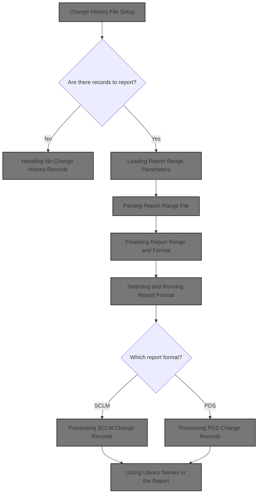

## Dependencies

### Program

- <SwmToken path="PDS/JXC370JX" pos="3:6:6" line-data="       PROGRAM-ID. JXC370JX.">`JXC370JX`</SwmToken> (<SwmPath>[PDS/JXC370JX](PDS/JXC370JX)</SwmPath>)

## Input and Output Tables/Files used in the Program

| Table / File Name                                                                                                                                     | Type | Description                                         | Usage Mode | Key Fields / Layout Highlights |
| ----------------------------------------------------------------------------------------------------------------------------------------------------- | ---- | --------------------------------------------------- | ---------- | ------------------------------ |
| <SwmToken path="PDS/JXC370JX" pos="668:3:7" line-data="              WRITE CHANGE-HIST-RPTREC FROM RPT01-DETAIL-LINE">`CHANGE-HIST-RPTREC`</SwmToken> | IMS  | Single output line for change history report        | Output     | Hierarchical segment structure |
| <SwmToken path="PDS/JXC370JX" pos="543:5:9" line-data="           OPEN INPUT CHANGE-HISTORY-FILE.">`CHANGE-HISTORY-FILE`</SwmToken>                   | IMS  | Source element change history records (audit trail) | Input      | Hierarchical segment structure |
| <SwmToken path="PDS/JXC370JX" pos="545:5:9" line-data="           OPEN OUTPUT CHANGE-HISTORY-RPT.">`CHANGE-HISTORY-RPT`</SwmToken>                    | IMS  | Formatted change history report output lines        | Output     | Hierarchical segment structure |
| <SwmToken path="PDS/JXC370JX" pos="63:3:5" line-data="           SELECT DEBUG-REPORT                  ASSIGN RDBUG.">`DEBUG-REPORT`</SwmToken>        | IMS  | Debugging output lines for program execution trace  | Output     | Hierarchical segment structure |
| <SwmToken path="PDS/JXC370JX" pos="96:3:7" line-data="       01  DEBUG-RPT-LINE              PIC X(133).">`DEBUG-RPT-LINE`</SwmToken>                 | IMS  | Single output line for debug report                 | Output     | Hierarchical segment structure |
| <SwmToken path="PDS/JXC370JX" pos="828:5:9" line-data="           OPEN INPUT LIBRARY-NAME-FILE.">`LIBRARY-NAME-FILE`</SwmToken>                       | IMS  | Cross-reference of library names for reporting      | Input      | Hierarchical segment structure |
| <SwmToken path="PDS/JXC370JX" pos="586:5:9" line-data="           OPEN INPUT RPT-RANGE-FILE.">`RPT-RANGE-FILE`</SwmToken>                             | IMS  | Report date range and format selection input        | Input      | Hierarchical segment structure |

&nbsp;

# Workflow

# Program Startup and Main Flow Control

This section governs the overall control flow of the program, ensuring that initialization, report generation, and termination are executed in the correct sequence to produce a valid change history report.

| Category        | Rule Name                  | Description                                                                                                                                        |
| --------------- | -------------------------- | -------------------------------------------------------------------------------------------------------------------------------------------------- |
| Data validation | Mandatory Initialization   | The program must initialize all required headers and parameters before any report generation can occur.                                            |
| Data validation | Clean Termination          | The program must perform termination logic to ensure all resources are released and the process concludes cleanly after report generation.         |
| Business logic  | Report Generation Sequence | The change history report must be generated as the core output of the program, and no other processing should occur before this step is completed. |

<SwmSnippet path="/PDS/JXC370JX" line="457">

---

PROCEDURE DIVISION kicks off the program: it runs initialization to set up headers and parameters, then calls <SwmToken path="PDS/JXC370JX" pos="461:3:9" line-data="           PERFORM C0100-CHG-HIST-REPORTS THRU C0100-EXIT.">`C0100-CHG-HIST-REPORTS`</SwmToken> to actually generate the change history report. We need to call <SwmToken path="PDS/JXC370JX" pos="461:3:9" line-data="           PERFORM C0100-CHG-HIST-REPORTS THRU C0100-EXIT.">`C0100-CHG-HIST-REPORTS`</SwmToken> next because that's where the report logic lives—without it, nothing gets processed or output. After that, it wraps up with termination logic.

```
       PROCEDURE DIVISION USING JXL-PARM-DATA.

           PERFORM A1000-INITIALIZATION THRU A1000-EXIT.

           PERFORM C0100-CHG-HIST-REPORTS THRU C0100-EXIT.


           PERFORM A9000-TERMINATION THRU A9000-EXIT.
           GOBACK.
```

---

</SwmSnippet>

# Report Generation Entry Point

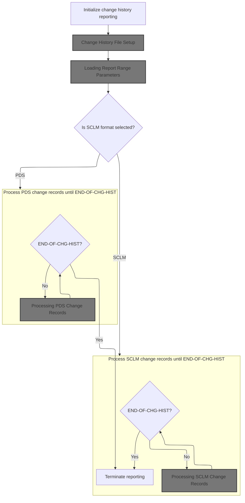

This section governs the initialization and entry logic for generating a change history report, ensuring that all necessary files and parameters are set up, and that the correct processing path (SCLM or PDS) is selected based on user or system input.

| Category        | Rule Name                     | Description                                                                                                                                                |
| --------------- | ----------------------------- | ---------------------------------------------------------------------------------------------------------------------------------------------------------- |
| Data validation | Change history file readiness | The change history report must not be generated unless the change history files are successfully opened and the first record is available.                 |
| Business logic  | Report format selection       | The report format (SCLM or PDS) must be determined based on the value of the report format parameter before processing any change records.                 |
| Business logic  | Date range enforcement        | The report must only include change records that fall within the specified date range parameters as determined by the report range file or default values. |
| Business logic  | End-of-history termination    | Processing of change records must continue until the end-of-change-history condition is reached, at which point report generation must terminate.          |

<SwmSnippet path="/PDS/JXC370JX" line="524">

---

In <SwmToken path="PDS/JXC370JX" pos="524:1:7" line-data="       C0100-CHG-HIST-REPORTS.">`C0100-CHG-HIST-REPORTS`</SwmToken>, we immediately call <SwmToken path="PDS/JXC370JX" pos="526:3:9" line-data="           PERFORM C0110-INIT-CHANGE-HISTORY THRU C0110-EXIT.">`C0110-INIT-CHANGE-HISTORY`</SwmToken> to open the change history files and get the first record ready. Without this, we can't process or report on any data, so it's the first step before any report logic.

```
       C0100-CHG-HIST-REPORTS.

           PERFORM C0110-INIT-CHANGE-HISTORY THRU C0110-EXIT.
```

---

</SwmSnippet>

## Change History File Setup

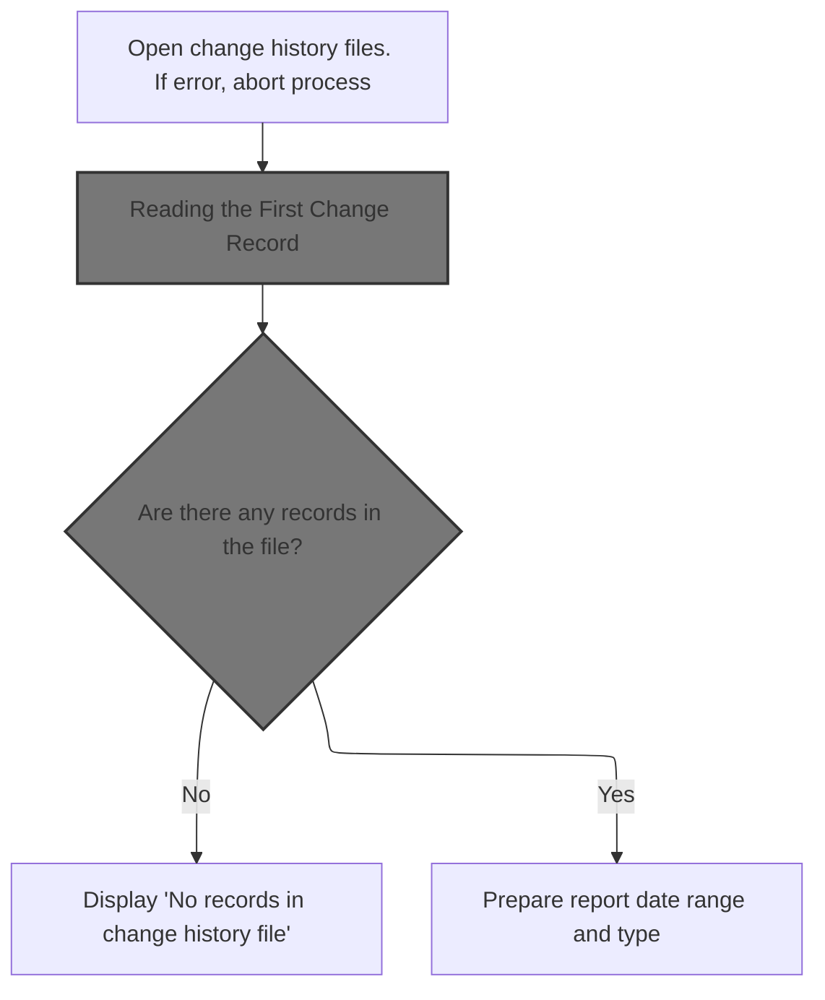

The main product role for this section is to ensure that the change history file is available and contains data before proceeding with report generation. It validates file accessibility and data presence, and sets up the necessary parameters for report creation.

| Category        | Rule Name                 | Description                                                                                                                                                |
| --------------- | ------------------------- | ---------------------------------------------------------------------------------------------------------------------------------------------------------- |
| Data validation | No Records Notification   | If there are no records in the change history file, a message must be displayed to inform the user and no report should be generated.                      |
| Business logic  | Prepare Report Parameters | If records are present in the change history file, the system must prepare the report date range and report type before proceeding with report generation. |

<SwmSnippet path="/PDS/JXC370JX" line="541">

---

In <SwmToken path="PDS/JXC370JX" pos="541:1:7" line-data="       C0110-INIT-CHANGE-HISTORY.">`C0110-INIT-CHANGE-HISTORY`</SwmToken>, after opening the input and output files, we check the file status. If the open is good, we call <SwmToken path="PDS/JXC370JX" pos="554:3:11" line-data="               PERFORM X0100-READ-CHG-HIST-MSTR THRU X0100-EXIT.">`X0100-READ-CHG-HIST-MSTR`</SwmToken> to grab the first record. This is needed to know if there's any data to report on.

```
       C0110-INIT-CHANGE-HISTORY.

           OPEN INPUT CHANGE-HISTORY-FILE.

           OPEN OUTPUT CHANGE-HISTORY-RPT.

           IF CHG-HIST-STATUS NOT = '00' AND '97'
               DISPLAY '   BAD OPEN ON CHG-HISTORY '
                       ' FILE. STATUS = '
                       CHG-HIST-STATUS
               MOVE 'Y' TO END-OF-CHG-HIST-SW
               PERFORM Z9000-ABEND-PROGRAM THRU Z9000-EXIT
           ELSE
               PERFORM X0100-READ-CHG-HIST-MSTR THRU X0100-EXIT.
```

---

</SwmSnippet>

### Reading the First Change Record

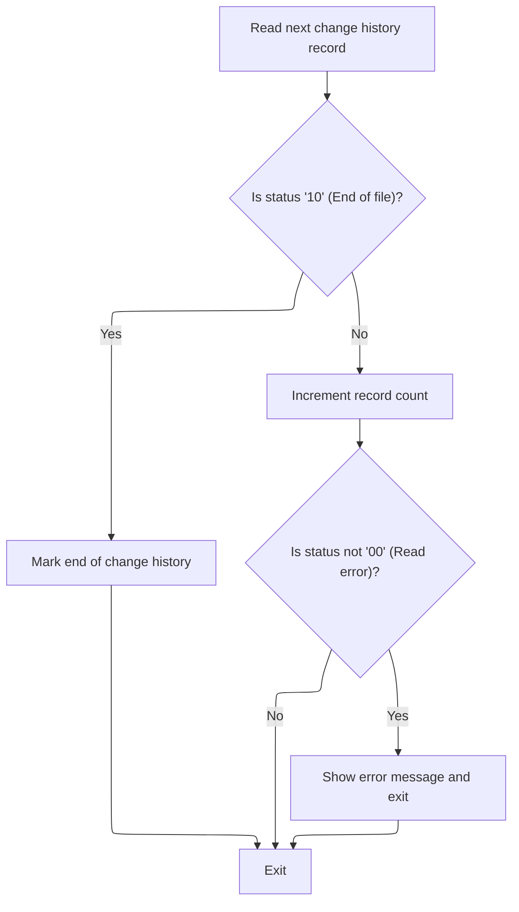

This section manages the process of reading records from the change history file, tracking the number of records processed, and handling end-of-file and error conditions to ensure accurate processing and reporting.

| Category       | Rule Name                       | Description                                                                                                                             |
| -------------- | ------------------------------- | --------------------------------------------------------------------------------------------------------------------------------------- |
| Business logic | End of Change History Detection | If the status code after reading a record is '10', the system must mark the end of the change history file and stop further processing. |
| Business logic | Record Counting                 | For each successfully read record (status code '00'), the system must increment the change history record count by one.                 |

<SwmSnippet path="/PDS/JXC370JX" line="883">

---

In <SwmToken path="PDS/JXC370JX" pos="883:1:9" line-data="       X0100-READ-CHG-HIST-MSTR.">`X0100-READ-CHG-HIST-MSTR`</SwmToken>, we read a record from the change history file. If the status is '10', that's end of file, so we set <SwmToken path="PDS/JXC370JX" pos="887:9:17" line-data="               MOVE &#39;Y&#39; TO END-OF-CHG-HIST-SW">`END-OF-CHG-HIST-SW`</SwmToken> to 'Y' and exit. If it's not '00', we display an error and exit. These status codes control the flow for reading records.

```
       X0100-READ-CHG-HIST-MSTR.
           READ CHANGE-HISTORY-FILE INTO SOURCE-HISTORY-RECORD.

           IF CHG-HIST-STATUS = '10'
               MOVE 'Y' TO END-OF-CHG-HIST-SW
               GO TO X0100-EXIT.
```

---

</SwmSnippet>

<SwmSnippet path="/PDS/JXC370JX" line="890">

---

After reading a record in <SwmToken path="PDS/JXC370JX" pos="554:3:11" line-data="               PERFORM X0100-READ-CHG-HIST-MSTR THRU X0100-EXIT.">`X0100-READ-CHG-HIST-MSTR`</SwmToken>, if it's a good read ('00'), we bump up <SwmToken path="PDS/JXC370JX" pos="890:7:11" line-data="           ADD 1           TO CHG-HIST-CNT">`CHG-HIST-CNT`</SwmToken>. If the status isn't '00', we log an error and exit. This keeps a running count of processed records and handles errors right away.

```
           ADD 1           TO CHG-HIST-CNT
           IF CHG-HIST-STATUS NOT = '00'
               DISPLAY '  BAD READ ON CHG-HISTORY '
                   ' FILE. STATUS = '
                   CHG-HIST-STATUS
                   ' ON RECORD NBR ' CHG-HIST-CNT
               GO TO X0100-EXIT.
```

---

</SwmSnippet>

### Handling No Change History Records

<SwmSnippet path="/PDS/JXC370JX" line="556">

---

Back in <SwmToken path="PDS/JXC370JX" pos="526:3:9" line-data="           PERFORM C0110-INIT-CHANGE-HISTORY THRU C0110-EXIT.">`C0110-INIT-CHANGE-HISTORY`</SwmToken>, after returning from <SwmToken path="PDS/JXC370JX" pos="554:3:11" line-data="               PERFORM X0100-READ-CHG-HIST-MSTR THRU X0100-EXIT.">`X0100-READ-CHG-HIST-MSTR`</SwmToken>, we check if <SwmToken path="PDS/JXC370JX" pos="556:3:9" line-data="           IF END-OF-CHG-HIST">`END-OF-CHG-HIST`</SwmToken> is set. If so, we display a message that there are no records and exit this part of the flow.

```
           IF END-OF-CHG-HIST
               DISPLAY '    '
               DISPLAY 'NO RECORDS IN CHG-HISTORY '
                       'FILE'
               GO TO C0110-EXIT.
```

---

</SwmSnippet>

<SwmSnippet path="/PDS/JXC370JX" line="562">

---

After making sure we have records, <SwmToken path="PDS/JXC370JX" pos="526:3:9" line-data="           PERFORM C0110-INIT-CHANGE-HISTORY THRU C0110-EXIT.">`C0110-INIT-CHANGE-HISTORY`</SwmToken> sets up the current date and default report range fields, then calls <SwmToken path="PDS/JXC370JX" pos="576:3:7" line-data="           PERFORM C0120-REPORT-RANGE">`C0120-REPORT-RANGE`</SwmToken> to load or override these with values from the report range file.

```
           MOVE WS-CDF-CCYY   TO WS-CURRENT-YEAR
           MOVE WS-CDF-MM     TO WS-CURRENT-MONTH
           MOVE WS-CDF-DD     TO WS-CURRENT-DAY.

           MOVE 'MTD' TO RR-REPORT-TYPE.
           MOVE '9999-99-99'      TO RR-START-DATE-CYMD.
           MOVE WS-CURRENT-YEAR   TO RR-START-GREG-CCYY
           MOVE WS-CURRENT-MONTH  TO RR-START-GREG-MM
           MOVE 01                TO RR-START-GREG-DD
           MOVE '9999-99-99'      TO RR-END-DATE-CYMD.
           MOVE WS-CURRENT-YEAR   TO RR-END-GREG-CCYY
           MOVE WS-CURRENT-MONTH  TO RR-END-GREG-MM
           MOVE 31                TO RR-END-GREG-DD.

           PERFORM C0120-REPORT-RANGE
              THRU C0120-EXIT.
```

---

</SwmSnippet>

## Loading Report Range Parameters

```mermaid
%%{init: {"flowchart": {"defaultRenderer": "elk"}} }%%
flowchart TD
    node1["Open report range file"]
    click node1 openCode "PDS/JXC370JX:586:586"
    node1 --> node2{"Is RPT-RANGE-STATUS = '00' or '97'?"}
    click node2 openCode "PDS/JXC370JX:588:595"
    node2 -->|"No (status not '00' or '97')"| node3["Display error and date range used (from RPT-RANGE-WORK)"]
    click node3 openCode "PDS/JXC370JX:589:592"
    node2 -->|"Yes (status '00' or '97')"| node4["Read and process report range"]
    click node4 openCode "PDS/JXC370JX:594:594"
    node3 --> node5["Close report range file"]
    node4 --> node5
    click node5 openCode "PDS/JXC370JX:597:597"
classDef HeadingStyle fill:#777777,stroke:#333,stroke-width:2px;

%% Swimm:
%% %%{init: {"flowchart": {"defaultRenderer": "elk"}} }%%
%% flowchart TD
%%     node1["Open report range file"]
%%     click node1 openCode "<SwmPath>[PDS/JXC370JX](PDS/JXC370JX)</SwmPath>:586:586"
%%     node1 --> node2{"Is <SwmToken path="PDS/JXC370JX" pos="588:3:7" line-data="           IF RPT-RANGE-STATUS NOT = &#39;00&#39; AND &#39;97&#39;">`RPT-RANGE-STATUS`</SwmToken> = '00' or '97'?"}
%%     click node2 openCode "<SwmPath>[PDS/JXC370JX](PDS/JXC370JX)</SwmPath>:588:595"
%%     node2 -->|"No (status not '00' or '97')"| node3["Display error and date range used (from <SwmToken path="PDS/JXC370JX" pos="592:14:18" line-data="               DISPLAY &#39;DATE RANGE USED = &#39; RPT-RANGE-WORK(1:30)">`RPT-RANGE-WORK`</SwmToken>)"]
%%     click node3 openCode "<SwmPath>[PDS/JXC370JX](PDS/JXC370JX)</SwmPath>:589:592"
%%     node2 -->|"Yes (status '00' or '97')"| node4["Read and process report range"]
%%     click node4 openCode "<SwmPath>[PDS/JXC370JX](PDS/JXC370JX)</SwmPath>:594:594"
%%     node3 --> node5["Close report range file"]
%%     node4 --> node5
%%     click node5 openCode "<SwmPath>[PDS/JXC370JX](PDS/JXC370JX)</SwmPath>:597:597"
%% classDef HeadingStyle fill:#777777,stroke:#333,stroke-width:2px;
```

This section ensures that the correct report range parameters are loaded for subsequent processing. It provides error handling and fallback to default values if the report range file cannot be accessed.

| Category       | Rule Name                          | Description                                                                                                                                            |
| -------------- | ---------------------------------- | ------------------------------------------------------------------------------------------------------------------------------------------------------ |
| Business logic | Use loaded report range parameters | If the report range file is opened successfully (status is '00' or '97'), the report range parameters must be read and used for subsequent processing. |

<SwmSnippet path="/PDS/JXC370JX" line="585">

---

<SwmToken path="PDS/JXC370JX" pos="585:1:5" line-data="       C0120-REPORT-RANGE.">`C0120-REPORT-RANGE`</SwmToken> opens the report range file and, if successful, calls <SwmToken path="PDS/JXC370JX" pos="594:3:9" line-data="               PERFORM X0200-READ-RPT-RANGE THRU X0200-EXIT">`X0200-READ-RPT-RANGE`</SwmToken> to read the actual parameters. If the open fails, it logs an error and uses whatever defaults are set.

```
       C0120-REPORT-RANGE.
           OPEN INPUT RPT-RANGE-FILE.

           IF RPT-RANGE-STATUS NOT = '00' AND '97'
               DISPLAY '   BAD OPEN ON RPT RANGE   '
                       ' FILE. STATUS = '
                       RPT-RANGE-STATUS
               DISPLAY 'DATE RANGE USED = ' RPT-RANGE-WORK(1:30)
           ELSE
               PERFORM X0200-READ-RPT-RANGE THRU X0200-EXIT
           END-IF.

           CLOSE RPT-RANGE-FILE.
```

---

</SwmSnippet>

## Parsing Report Range File

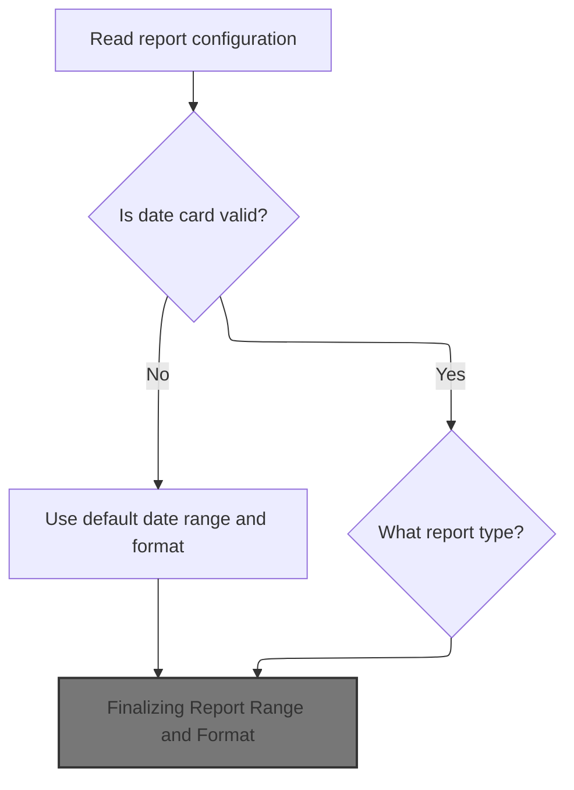

This section determines the report's date range and type by reading a configuration file. It ensures that the report is generated with the correct date range and format, using defaults if necessary, and logs any issues encountered.

| Category       | Rule Name             | Description                                                                                                                                                                                     |
| -------------- | --------------------- | ----------------------------------------------------------------------------------------------------------------------------------------------------------------------------------------------- |
| Business logic | Report Type Selection | The report type must be determined from the configuration file. Supported types are 'PREVMTD', 'MTD', 'RANGE', and 'DAILY'. Each type triggers a specific logic to set the report's date range. |
| Business logic | Finalize Report Range | The date range and format must be finalized and available for downstream report generation, regardless of whether they were set from the file or defaults.                                      |

<SwmSnippet path="/PDS/JXC370JX" line="910">

---

In <SwmToken path="PDS/JXC370JX" pos="910:1:7" line-data="       X0200-READ-RPT-RANGE.">`X0200-READ-RPT-RANGE`</SwmToken>, we read the first record for date range and report type. If it's missing or status is '10', we use MTD defaults. This two-record structure lets us handle date and format separately, and fallback to defaults if needed.

```
       X0200-READ-RPT-RANGE.
           MOVE ZERO TO WS-PLUS-DAYS.

           READ RPT-RANGE-FILE INTO RPT-RANGE-WORK.

           IF RPT-RANGE-STATUS = '10'
               DISPLAY 'NO DATE CARD. USING MTD DEFAULT'
               DISPLAY 'DATE RANGE USED = ' RPT-RANGE-WORK(1:50)
               GO TO X0200-EXIT
           END-IF.
```

---

</SwmSnippet>

<SwmSnippet path="/PDS/JXC370JX" line="921">

---

If the read fails, we log it and use defaults for the date range.

```
           IF RPT-RANGE-STATUS NOT = '00'
               DISPLAY '  BAD READ ON RPT RANGE'
                   ' FILE. STATUS = '
                   RPT-RANGE-STATUS
               DISPLAY 'NO DATE CARD. USING MTD DEFAULT'
               DISPLAY 'DATE RANGE USED = ' RPT-RANGE-WORK(1:50)
               GO TO X0200-EXIT
           END-IF.
```

---

</SwmSnippet>

<SwmSnippet path="/PDS/JXC370JX" line="931">

---

After reading the date card, <SwmToken path="PDS/JXC370JX" pos="594:3:9" line-data="               PERFORM X0200-READ-RPT-RANGE THRU X0200-EXIT">`X0200-READ-RPT-RANGE`</SwmToken> checks <SwmToken path="PDS/JXC370JX" pos="934:3:7" line-data="           IF RR-REPORT-TYPE = &#39;PREVMTD&#39;">`RR-REPORT-TYPE`</SwmToken> and calls the right subroutine to set the date range. If the type is unknown, it logs a message and uses month-to-date as a fallback.

```
           DISPLAY '           '.
           DISPLAY 'DATE CARD READ  = ' RPT-RANGE-WORK(1:50)

           IF RR-REPORT-TYPE = 'PREVMTD'
              PERFORM X0201-RPT-RANGE-PREVMTD THRU X0201-EXIT
           ELSE
           IF RR-REPORT-TYPE = 'MTD'
              PERFORM X0202-RPT-RANGE-MTD THRU X0202-EXIT
           ELSE
           IF RR-REPORT-TYPE = 'RANGE'
              PERFORM X0203-RPT-RANGE-INCARD THRU X0203-EXIT
           ELSE
           IF RR-REPORT-TYPE = 'DAILY'
              PERFORM X0204-RPT-RANGE-DAILY THRU X0204-EXIT
           ELSE
              DISPLAY 'UNKNOWN REPORT TYPE. IF DATES ARE INVALID, '
                      'MTD DATE RANGE WILL BE USED.'
              PERFORM X0202-RPT-RANGE-MTD THRU X0202-EXIT
           END-IF.
```

---

</SwmSnippet>

### Setting Previous Month Date Range

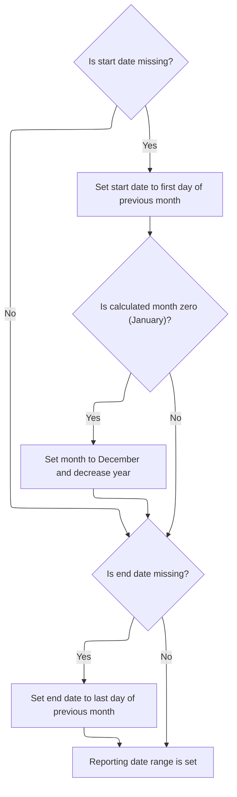

This section ensures that the reporting date range is always valid by defaulting missing start or end dates to the previous month, covering the full month, and handling year transitions as needed.

| Category        | Rule Name                         | Description                                                                                                                                                                                                                                                                                    |
| --------------- | --------------------------------- | ---------------------------------------------------------------------------------------------------------------------------------------------------------------------------------------------------------------------------------------------------------------------------------------------- |
| Data validation | System-Generated Date Placeholder | If either the start or end date is missing, the corresponding date field is set to the placeholder value <SwmToken path="PDS/JXC370JX" pos="567:4:8" line-data="           MOVE &#39;9999-99-99&#39;      TO RR-START-DATE-CYMD.">`9999-99-99`</SwmToken> to indicate it was system-generated. |
| Business logic  | Default Previous Month Start Date | If the start date is missing, the start date is set to the first day of the previous month. If the current month is January, the month is set to December and the year is decreased by one.                                                                                                    |
| Business logic  | Default Previous Month End Date   | If the end date is missing, the end date is set to the last day (31st) of the same month and year as the start date, regardless of the actual number of days in the month.                                                                                                                     |

<SwmSnippet path="/PDS/JXC370JX" line="992">

---

If the start date is missing, we use <SwmToken path="PDS/JXC370JX" pos="995:4:8" line-data="              MOVE &#39;9999-99-99&#39;      TO RR-START-DATE-CYMD">`9999-99-99`</SwmToken> and set the range to the first day of the previous month, rolling back the year if needed.

```
       X0201-RPT-RANGE-PREVMTD.

           IF RR-START-DATE-CYMD = SPACE
              MOVE '9999-99-99'      TO RR-START-DATE-CYMD
              MOVE WS-CURRENT-YEAR   TO RR-START-GREG-CCYY
              MOVE WS-CURRENT-MONTH  TO RR-START-GREG-MM
              MOVE 01                TO RR-START-GREG-DD
              SUBTRACT 1 FROM RR-START-GREG-MM
              IF RR-START-GREG-MM = 0
                 MOVE 12 TO RR-START-GREG-MM
                 SUBTRACT 1 FROM RR-START-GREG-CCYY
              END-IF
           END-IF
```

---

</SwmSnippet>

<SwmSnippet path="/PDS/JXC370JX" line="1006">

---

If the end date is missing in <SwmToken path="PDS/JXC370JX" pos="935:3:9" line-data="              PERFORM X0201-RPT-RANGE-PREVMTD THRU X0201-EXIT">`X0201-RPT-RANGE-PREVMTD`</SwmToken>, we set it to <SwmToken path="PDS/JXC370JX" pos="1007:4:8" line-data="              MOVE &#39;9999-99-99&#39;      TO RR-END-DATE-CYMD">`9999-99-99`</SwmToken> and use the same year/month as the start, with day 31. It's a simple way to cover the whole month, even if the month is shorter.

```
           IF RR-END-DATE-CYMD = SPACE
              MOVE '9999-99-99'      TO RR-END-DATE-CYMD
              MOVE RR-START-GREG-CCYY TO RR-END-GREG-CCYY
              MOVE RR-START-GREG-MM   TO RR-END-GREG-MM
              MOVE 31                 TO RR-END-GREG-DD
           END-IF.
```

---

</SwmSnippet>

### Defaulting Date Range from Input Card

```mermaid
%%{init: {"flowchart": {"defaultRenderer": "elk"}} }%%
flowchart TD
    node1{"Is report start date missing?"}
    click node1 openCode "PDS/JXC370JX:1059:1064"
    node1 -->|"Yes"| node2["Set start date to 9999-99-99, current year, current month, day 01"]
    click node2 openCode "PDS/JXC370JX:1060:1063"
    node1 -->|"No"| node3{"Is report end date missing?"}
    click node3 openCode "PDS/JXC370JX:1066:1071"
    node2 --> node3
    node3 -->|"Yes"| node4["Set end date to 9999-99-99, current year, current month, day 31"]
    click node4 openCode "PDS/JXC370JX:1067:1070"
    node3 -->|"No"| node5["Report date range finalized"]
    click node5 openCode "PDS/JXC370JX:1064:1071"
    node4 --> node5
classDef HeadingStyle fill:#777777,stroke:#333,stroke-width:2px;

%% Swimm:
%% %%{init: {"flowchart": {"defaultRenderer": "elk"}} }%%
%% flowchart TD
%%     node1{"Is report start date missing?"}
%%     click node1 openCode "<SwmPath>[PDS/JXC370JX](PDS/JXC370JX)</SwmPath>:1059:1064"
%%     node1 -->|"Yes"| node2["Set start date to <SwmToken path="PDS/JXC370JX" pos="567:4:8" line-data="           MOVE &#39;9999-99-99&#39;      TO RR-START-DATE-CYMD.">`9999-99-99`</SwmToken>, current year, current month, day 01"]
%%     click node2 openCode "<SwmPath>[PDS/JXC370JX](PDS/JXC370JX)</SwmPath>:1060:1063"
%%     node1 -->|"No"| node3{"Is report end date missing?"}
%%     click node3 openCode "<SwmPath>[PDS/JXC370JX](PDS/JXC370JX)</SwmPath>:1066:1071"
%%     node2 --> node3
%%     node3 -->|"Yes"| node4["Set end date to <SwmToken path="PDS/JXC370JX" pos="567:4:8" line-data="           MOVE &#39;9999-99-99&#39;      TO RR-START-DATE-CYMD.">`9999-99-99`</SwmToken>, current year, current month, day 31"]
%%     click node4 openCode "<SwmPath>[PDS/JXC370JX](PDS/JXC370JX)</SwmPath>:1067:1070"
%%     node3 -->|"No"| node5["Report date range finalized"]
%%     click node5 openCode "<SwmPath>[PDS/JXC370JX](PDS/JXC370JX)</SwmPath>:1064:1071"
%%     node4 --> node5
%% classDef HeadingStyle fill:#777777,stroke:#333,stroke-width:2px;
```

This section ensures that every report has a valid date range by defaulting missing start or end dates to the current month and year, covering the full month if necessary.

| Category        | Rule Name               | Description                                                                                                                        |
| --------------- | ----------------------- | ---------------------------------------------------------------------------------------------------------------------------------- |
| Data validation | Use provided date range | If both start and end dates are provided in the input, the report date range is finalized as given, without applying any defaults. |

<SwmSnippet path="/PDS/JXC370JX" line="1057">

---

In <SwmToken path="PDS/JXC370JX" pos="1057:1:7" line-data="       X0203-RPT-RANGE-INCARD.">`X0203-RPT-RANGE-INCARD`</SwmToken>, if the start date is blank, we set it to <SwmToken path="PDS/JXC370JX" pos="1060:4:8" line-data="              MOVE &#39;9999-99-99&#39;      TO RR-START-DATE-CYMD">`9999-99-99`</SwmToken>, use the current year/month, and set the day to 01. This gives us a default range from the first of the month.

```
       X0203-RPT-RANGE-INCARD.

           IF RR-START-DATE-CYMD = SPACE
              MOVE '9999-99-99'      TO RR-START-DATE-CYMD
              MOVE WS-CURRENT-YEAR   TO RR-START-GREG-CCYY
              MOVE WS-CURRENT-MONTH  TO RR-START-GREG-MM
              MOVE 01                TO RR-START-GREG-DD
           END-IF.
```

---

</SwmSnippet>

<SwmSnippet path="/PDS/JXC370JX" line="1066">

---

If the end date is missing in <SwmToken path="PDS/JXC370JX" pos="941:3:9" line-data="              PERFORM X0203-RPT-RANGE-INCARD THRU X0203-EXIT">`X0203-RPT-RANGE-INCARD`</SwmToken>, we set it to <SwmToken path="PDS/JXC370JX" pos="1067:4:8" line-data="              MOVE &#39;9999-99-99&#39;      TO RR-END-DATE-CYMD">`9999-99-99`</SwmToken>, use the current year/month, and set the day to 31. This covers the whole month, regardless of actual month length.

```
           IF RR-END-DATE-CYMD = SPACE
              MOVE '9999-99-99'      TO RR-END-DATE-CYMD
              MOVE WS-CURRENT-YEAR   TO RR-END-GREG-CCYY
              MOVE WS-CURRENT-MONTH  TO RR-END-GREG-MM
              MOVE 31                TO RR-END-GREG-DD
           END-IF.
```

---

</SwmSnippet>

### Calculating Daily Report Range

```mermaid
%%{init: {"flowchart": {"defaultRenderer": "elk"}} }%%
flowchart TD
    node1["Check if user requested to extend report range"] --> node2{"Is range extension requested?"}
    click node1 openCode "PDS/JXC370JX:1082:1085"
    node2 -->|"Yes"| node3["Extend report range by specified days"]
    click node2 openCode "PDS/JXC370JX:1082:1085"
    node2 -->|"No"| node4
    node3 --> node4
    node4 --> node5{"Is report start date missing?"}
    click node4 openCode "PDS/JXC370JX:1087:1092"
    node5 -->|"Yes"| node6["Set report start date to current date"]
    click node5 openCode "PDS/JXC370JX:1087:1092"
    node5 -->|"No"| node7
    node6 --> node7
    node7 --> node8{"Is report end date missing?"}
    click node7 openCode "PDS/JXC370JX:1093:1098"
    node8 -->|"Yes"| node9["Set report end date to current date"]
    click node8 openCode "PDS/JXC370JX:1093:1098"
    node8 -->|"No"| node10
    node9 --> node10
    node10 --> node11{"Is number of days to extend > 0?"}
    click node10 openCode "PDS/JXC370JX:1100:1120"
    node11 -->|"Yes"| node12{"Is current day > days to extend?"}
    click node11 openCode "PDS/JXC370JX:1101:1102"
    node12 -->|"Yes"| node13["Subtract days from start date"]
    click node13 openCode "PDS/JXC370JX:1102:1102"
    node12 -->|"No"| node14{"Is month at boundary after adjustment?"}
    click node14 openCode "PDS/JXC370JX:1105:1109"
    node14 -->|"Yes"| node15["Adjust month and year"]
    click node15 openCode "PDS/JXC370JX:1107:1109"
    node14 -->|"No"| node16
    node15 --> node16
    node16{"Which month type?"} -->|"30-day month"| node17["Subtract days based on 30-day month"]
    click node17 openCode "PDS/JXC370JX:1110:1112"
    node16 -->|"February"| node18["Subtract days based on 28-day month"]
    click node18 openCode "PDS/JXC370JX:1113:1114"
    node16 -->|"31-day month"| node19["Subtract days based on 31-day month"]
    click node19 openCode "PDS/JXC370JX:1115:1116"
    node17 --> node20["Report range finalized"]
    node18 --> node20
    node19 --> node20
    node13 --> node20
    node11 -->|"No"| node20["Report range finalized"]
    click node20 openCode "PDS/JXC370JX:1080:1120"
classDef HeadingStyle fill:#777777,stroke:#333,stroke-width:2px;

%% Swimm:
%% %%{init: {"flowchart": {"defaultRenderer": "elk"}} }%%
%% flowchart TD
%%     node1["Check if user requested to extend report range"] --> node2{"Is range extension requested?"}
%%     click node1 openCode "<SwmPath>[PDS/JXC370JX](PDS/JXC370JX)</SwmPath>:1082:1085"
%%     node2 -->|"Yes"| node3["Extend report range by specified days"]
%%     click node2 openCode "<SwmPath>[PDS/JXC370JX](PDS/JXC370JX)</SwmPath>:1082:1085"
%%     node2 -->|"No"| node4
%%     node3 --> node4
%%     node4 --> node5{"Is report start date missing?"}
%%     click node4 openCode "<SwmPath>[PDS/JXC370JX](PDS/JXC370JX)</SwmPath>:1087:1092"
%%     node5 -->|"Yes"| node6["Set report start date to current date"]
%%     click node5 openCode "<SwmPath>[PDS/JXC370JX](PDS/JXC370JX)</SwmPath>:1087:1092"
%%     node5 -->|"No"| node7
%%     node6 --> node7
%%     node7 --> node8{"Is report end date missing?"}
%%     click node7 openCode "<SwmPath>[PDS/JXC370JX](PDS/JXC370JX)</SwmPath>:1093:1098"
%%     node8 -->|"Yes"| node9["Set report end date to current date"]
%%     click node8 openCode "<SwmPath>[PDS/JXC370JX](PDS/JXC370JX)</SwmPath>:1093:1098"
%%     node8 -->|"No"| node10
%%     node9 --> node10
%%     node10 --> node11{"Is number of days to extend > 0?"}
%%     click node10 openCode "<SwmPath>[PDS/JXC370JX](PDS/JXC370JX)</SwmPath>:1100:1120"
%%     node11 -->|"Yes"| node12{"Is current day > days to extend?"}
%%     click node11 openCode "<SwmPath>[PDS/JXC370JX](PDS/JXC370JX)</SwmPath>:1101:1102"
%%     node12 -->|"Yes"| node13["Subtract days from start date"]
%%     click node13 openCode "<SwmPath>[PDS/JXC370JX](PDS/JXC370JX)</SwmPath>:1102:1102"
%%     node12 -->|"No"| node14{"Is month at boundary after adjustment?"}
%%     click node14 openCode "<SwmPath>[PDS/JXC370JX](PDS/JXC370JX)</SwmPath>:1105:1109"
%%     node14 -->|"Yes"| node15["Adjust month and year"]
%%     click node15 openCode "<SwmPath>[PDS/JXC370JX](PDS/JXC370JX)</SwmPath>:1107:1109"
%%     node14 -->|"No"| node16
%%     node15 --> node16
%%     node16{"Which month type?"} -->|"30-day month"| node17["Subtract days based on 30-day month"]
%%     click node17 openCode "<SwmPath>[PDS/JXC370JX](PDS/JXC370JX)</SwmPath>:1110:1112"
%%     node16 -->|"February"| node18["Subtract days based on 28-day month"]
%%     click node18 openCode "<SwmPath>[PDS/JXC370JX](PDS/JXC370JX)</SwmPath>:1113:1114"
%%     node16 -->|"31-day month"| node19["Subtract days based on 31-day month"]
%%     click node19 openCode "<SwmPath>[PDS/JXC370JX](PDS/JXC370JX)</SwmPath>:1115:1116"
%%     node17 --> node20["Report range finalized"]
%%     node18 --> node20
%%     node19 --> node20
%%     node13 --> node20
%%     node11 -->|"No"| node20["Report range finalized"]
%%     click node20 openCode "<SwmPath>[PDS/JXC370JX](PDS/JXC370JX)</SwmPath>:1080:1120"
%% classDef HeadingStyle fill:#777777,stroke:#333,stroke-width:2px;
```

This section determines the daily report range for the report, ensuring that the start and end dates are always set, and applying any user-requested lookback period. It handles missing dates and adjusts for month boundaries.

| Category        | Rule Name                 | Description                                                                                                                                                                                                             |
| --------------- | ------------------------- | ----------------------------------------------------------------------------------------------------------------------------------------------------------------------------------------------------------------------- |
| Data validation | Default start date        | If the report start date is missing, it is set to the current date to ensure the report has a valid range.                                                                                                              |
| Data validation | Default end date          | If the report end date is missing, it is set to the current date to ensure the report has a valid range.                                                                                                                |
| Business logic  | Report range extension    | If the user requests to extend the report range and provides a numeric number of days, the report start date is offset backwards by that number of days.                                                                |
| Business logic  | Month boundary adjustment | When offsetting the start date by a number of days, if the offset exceeds the current day, the month and year are rolled back, and the day is set based on the previous month's length (30, 31, or 28 days).            |
| Business logic  | Month length handling     | The day value for the start date is set according to the length of the previous month: 30 days for April, June, September, November; 28 days for February; 31 days for all other months. Leap years are not considered. |

<SwmSnippet path="/PDS/JXC370JX" line="1080">

---

In <SwmToken path="PDS/JXC370JX" pos="1080:1:7" line-data="       X0204-RPT-RANGE-DAILY.">`X0204-RPT-RANGE-DAILY`</SwmToken>, if <SwmToken path="PDS/JXC370JX" pos="1082:3:7" line-data="           IF RR-MTD-PLUS = &#39;+&#39; AND RR-MTD-PLUS-DAYS NUMERIC">`RR-MTD-PLUS`</SwmToken> is '+' and the days field is numeric, we set <SwmToken path="PDS/JXC370JX" pos="1083:13:17" line-data="              MOVE RR-MTD-PLUS-DAYS TO WS-PLUS-DAYS">`WS-PLUS-DAYS`</SwmToken> and clear the start date. This sets up for a dynamic date range based on a lookback period.

```
       X0204-RPT-RANGE-DAILY.

           IF RR-MTD-PLUS = '+' AND RR-MTD-PLUS-DAYS NUMERIC
              MOVE RR-MTD-PLUS-DAYS TO WS-PLUS-DAYS
              MOVE SPACE TO RR-START-DATE-CYMD
           END-IF.
```

---

</SwmSnippet>

<SwmSnippet path="/PDS/JXC370JX" line="1087">

---

If the start date is still blank after plus-days logic, we set it to <SwmToken path="PDS/JXC370JX" pos="1088:4:8" line-data="              MOVE &#39;9999-99-99&#39;      TO RR-START-DATE-CYMD">`9999-99-99`</SwmToken> and use the current date components. This keeps the logic consistent for missing dates.

```
           IF RR-START-DATE-CYMD = SPACE
              MOVE '9999-99-99'      TO RR-START-DATE-CYMD
              MOVE WS-CURRENT-YEAR   TO RR-START-GREG-CCYY
              MOVE WS-CURRENT-MONTH  TO RR-START-GREG-MM
              MOVE WS-CURRENT-DAY    TO RR-START-GREG-DD
           END-IF.
```

---

</SwmSnippet>

<SwmSnippet path="/PDS/JXC370JX" line="1093">

---

Same deal for the end date—if it's blank, we set it to <SwmToken path="PDS/JXC370JX" pos="1094:4:8" line-data="              MOVE &#39;9999-99-99&#39;      TO RR-END-DATE-CYMD">`9999-99-99`</SwmToken> and use the current date. This way, both start and end are always set for the report.

```
           IF RR-END-DATE-CYMD = SPACE
              MOVE '9999-99-99'      TO RR-END-DATE-CYMD
              MOVE WS-CURRENT-YEAR   TO RR-END-GREG-CCYY
              MOVE WS-CURRENT-MONTH  TO RR-END-GREG-MM
              MOVE WS-CURRENT-DAY    TO RR-END-GREG-DD
           END-IF.
```

---

</SwmSnippet>

<SwmSnippet path="/PDS/JXC370JX" line="1100">

---

If <SwmToken path="PDS/JXC370JX" pos="1100:3:7" line-data="           IF WS-PLUS-DAYS &gt; 0">`WS-PLUS-DAYS`</SwmToken> is set, we adjust the start date by subtracting days. If the offset is bigger than the current day, we roll back the month and year, and set the day based on the previous month's length (30, 31, or 28).

```
           IF WS-PLUS-DAYS > 0
              IF WS-CURRENT-DAY >  WS-PLUS-DAYS
                 SUBTRACT WS-PLUS-DAYS FROM RR-START-GREG-DD
```

---

</SwmSnippet>

<SwmSnippet path="/PDS/JXC370JX" line="1103">

---

After rolling back the month, the code sets the day to 30, 28, or 31 depending on the month. It's a simple way to handle different month lengths, but doesn't do leap years.

```
              ELSE
                 SUBTRACT RR-END-GREG-DD FROM WS-PLUS-DAYS
                 SUBTRACT 1 FROM RR-START-GREG-MM
                 IF RR-START-GREG-MM = 0
                    MOVE 12 TO RR-START-GREG-MM
                    SUBTRACT 1 FROM RR-START-GREG-CCYY
                 END-IF
```

---

</SwmSnippet>

<SwmSnippet path="/PDS/JXC370JX" line="1110">

---

After all the adjustments, <SwmToken path="PDS/JXC370JX" pos="944:3:9" line-data="              PERFORM X0204-RPT-RANGE-DAILY THRU X0204-EXIT">`X0204-RPT-RANGE-DAILY`</SwmToken> returns a start date that's offset by the plus-days value, rolling back months/years as needed. The end date is just the current date.

```
                 IF RR-START-GREG-MM = 9 OR 4 OR 6 OR 11
                    COMPUTE RR-START-GREG-DD = 30 - WS-PLUS-DAYS
                 ELSE
                 IF RR-START-GREG-MM = 2
                    COMPUTE RR-START-GREG-DD = 28 - WS-PLUS-DAYS
                 ELSE
                    COMPUTE RR-START-GREG-DD = 31 - WS-PLUS-DAYS
                 END-IF
                 END-IF
              END-IF
           END-IF.
```

---

</SwmSnippet>

### Finalizing Report Range and Format

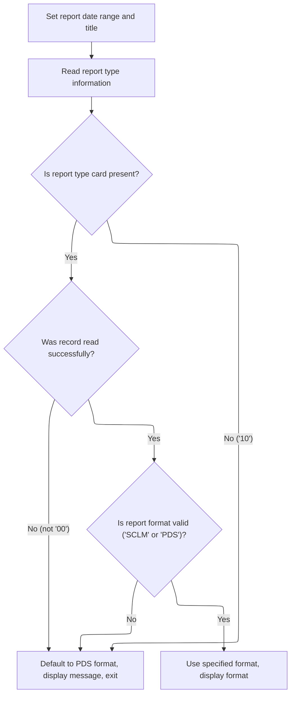

<SwmSnippet path="/PDS/JXC370JX" line="951">

---

After returning from <SwmToken path="PDS/JXC370JX" pos="944:3:9" line-data="              PERFORM X0204-RPT-RANGE-DAILY THRU X0204-EXIT">`X0204-RPT-RANGE-DAILY`</SwmToken>, <SwmToken path="PDS/JXC370JX" pos="594:3:9" line-data="               PERFORM X0200-READ-RPT-RANGE THRU X0200-EXIT">`X0200-READ-RPT-RANGE`</SwmToken> copies the computed date range into the global report variables and reads the second record to get the report format. If that's missing, it defaults to PDS.

```
           DISPLAY 'DATE RANGE USED = ' RPT-RANGE-WORK(1:50)
           MOVE RR-START-DATE-CYMD TO RPT01-FROM-DATE.
           MOVE RR-END-DATE-CYMD   TO RPT01-TO-DATE.
           MOVE RPT01-TITLE        TO RPT02-TITLE.

      * READ SECOND RECORD.  THIS SHOWS WHICH REPORT TO FORMAT
           READ RPT-RANGE-FILE INTO RPT-DATA-TYPE.

           IF RPT-RANGE-STATUS = '10'
               DISPLAY 'NO RPT TYPE CARD. USING PDS DEFAULT'
               MOVE 'PDS' TO RR-REPORT-FORMAT
               GO TO X0200-EXIT
           END-IF.
```

---

</SwmSnippet>

<SwmSnippet path="/PDS/JXC370JX" line="965">

---

If the format read fails, we log it and use PDS as the default.

```
           IF RPT-RANGE-STATUS NOT = '00'
               DISPLAY '  BAD READ ON RPT RANGE'
                   ' FILE SECOND RECORD. STATUS = '
                   RPT-RANGE-STATUS
               DISPLAY 'NO RPT TYPE CARD. USING PDS DEFAULT'
               MOVE 'PDS' TO RR-REPORT-FORMAT
               GO TO X0200-EXIT
           END-IF.
```

---

</SwmSnippet>

<SwmSnippet path="/PDS/JXC370JX" line="974">

---

After reading the second record, if the format is invalid, we log a message and set the report format to PDS. Otherwise, we display the format being used. This keeps the report logic consistent.

```
           IF NOT RR-VALID-RPT-FORMAT
               DISPLAY 'INVALID RPT-TYPE CARD IN SECOND RECORD. '
                       'USING PDS DEFAULT'
               DISPLAY '   DATA TYPE ENTERED = ' RR-REPORT-FORMAT
               DISPLAY '   VALID VALUES ARE "SCLM" AND "PDS" '
               MOVE 'PDS' TO RR-REPORT-FORMAT
               GO TO X0200-EXIT
           ELSE
               DISPLAY '   REPORT FORMAT = ' RR-REPORT-FORMAT
           END-IF.
```

---

</SwmSnippet>

## Selecting and Running Report Format

<SwmSnippet path="/PDS/JXC370JX" line="528">

---

After returning from <SwmToken path="PDS/JXC370JX" pos="526:3:9" line-data="           PERFORM C0110-INIT-CHANGE-HISTORY THRU C0110-EXIT.">`C0110-INIT-CHANGE-HISTORY`</SwmToken>, <SwmToken path="PDS/JXC370JX" pos="461:3:9" line-data="           PERFORM C0100-CHG-HIST-REPORTS THRU C0100-EXIT.">`C0100-CHG-HIST-REPORTS`</SwmToken> checks the report format and calls either <SwmToken path="PDS/JXC370JX" pos="529:3:9" line-data="              PERFORM C0200-PROCESS-CHG-SCLM THRU C0200-EXIT">`C0200-PROCESS-CHG-SCLM`</SwmToken> or <SwmToken path="PDS/JXC370JX" pos="532:3:9" line-data="              PERFORM C0300-PROCESS-CHG-PDS  THRU C0300-EXIT">`C0300-PROCESS-CHG-PDS`</SwmToken> in a loop until all records are done. This picks the right logic for the report type.

```
           IF RR-SCLM-FORMAT
              PERFORM C0200-PROCESS-CHG-SCLM THRU C0200-EXIT
                  UNTIL END-OF-CHG-HIST
           ELSE
              PERFORM C0300-PROCESS-CHG-PDS  THRU C0300-EXIT
                  UNTIL END-OF-CHG-HIST
           END-IF.

           PERFORM C0900-TERMINATE-CHANGE-HISTORY THRU C0900-EXIT.
```

---

</SwmSnippet>

## Processing SCLM Change Records

```mermaid
%%{init: {"flowchart": {"defaultRenderer": "elk"}} }%%
flowchart TD
    node1["Start processing change history for element"]
    click node1 openCode "PDS/JXC370JX:605:606"
    subgraph loop1["Read history records until record in date range or end of history"]
        node1 --> node2{"Is record in date range or end of history?"}
        click node2 openCode "PDS/JXC370JX:610:614"
        node2 -->|"No"| node3["Save previous record for report"]
        click node3 openCode "PDS/JXC370JX:615:615"
        node3 --> node4["Read next history record"]
        click node4 openCode "PDS/JXC370JX:616:616"
        node4 --> node2
    end
    node2 -->|"Yes"| node5{"End of change history?"}
    click node5 openCode "PDS/JXC370JX:619:621"
    node5 -->|"Yes"| node10["Exit"]
    click node10 openCode "PDS/JXC370JX:620:621"
    node5 -->|"No"| node6{"Change type?"}
    click node6 openCode "PDS/JXC370JX:633:648"
    node6 -->|"New element"| node7["Update new element counter"]
    click node7 openCode "PDS/JXC370JX:636:637"
    node6 -->|"Deleted"| node8["Update deleted element counter"]
    click node8 openCode "PDS/JXC370JX:639:640"
    node6 -->|"Changed"| node9["Update changed element counter"]
    click node9 openCode "PDS/JXC370JX:646:647"
    node7 --> node11["Set current element and library"]
    click node11 openCode "PDS/JXC370JX:652:653"
    node8 --> node11
    node9 --> node11
    subgraph loop2["Print report lines for current element/library"]
        node11 --> node12["Print report line"]
        click node12 openCode "PDS/JXC370JX:659:660"
        node12 --> node13{"End of change history or new element/library?"}
        click node13 openCode "PDS/JXC370JX:655:658"
        node13 -->|"No"| node14["Read next history record"]
        click node14 openCode "PDS/JXC370JX:662:662"
        node14 --> node12
    end
    node13 -->|"Yes"| node15{"Is page full?"}
    click node15 openCode "PDS/JXC370JX:624:625"
    node15 -->|"No"| node16["Write report line"]
    click node16 openCode "PDS/JXC370JX:668:670"
    node15 -->|"Yes"| node17["Print heading and write report line"]
    click node17 openCode "PDS/JXC370JX:626:628"
    node16 --> node10
    node17 --> node10

classDef HeadingStyle fill:#777777,stroke:#333,stroke-width:2px;

%% Swimm:
%% %%{init: {"flowchart": {"defaultRenderer": "elk"}} }%%
%% flowchart TD
%%     node1["Start processing change history for element"]
%%     click node1 openCode "<SwmPath>[PDS/JXC370JX](PDS/JXC370JX)</SwmPath>:605:606"
%%     subgraph loop1["Read history records until record in date range or end of history"]
%%         node1 --> node2{"Is record in date range or end of history?"}
%%         click node2 openCode "<SwmPath>[PDS/JXC370JX](PDS/JXC370JX)</SwmPath>:610:614"
%%         node2 -->|"No"| node3["Save previous record for report"]
%%         click node3 openCode "<SwmPath>[PDS/JXC370JX](PDS/JXC370JX)</SwmPath>:615:615"
%%         node3 --> node4["Read next history record"]
%%         click node4 openCode "<SwmPath>[PDS/JXC370JX](PDS/JXC370JX)</SwmPath>:616:616"
%%         node4 --> node2
%%     end
%%     node2 -->|"Yes"| node5{"End of change history?"}
%%     click node5 openCode "<SwmPath>[PDS/JXC370JX](PDS/JXC370JX)</SwmPath>:619:621"
%%     node5 -->|"Yes"| node10["Exit"]
%%     click node10 openCode "<SwmPath>[PDS/JXC370JX](PDS/JXC370JX)</SwmPath>:620:621"
%%     node5 -->|"No"| node6{"Change type?"}
%%     click node6 openCode "<SwmPath>[PDS/JXC370JX](PDS/JXC370JX)</SwmPath>:633:648"
%%     node6 -->|"New element"| node7["Update new element counter"]
%%     click node7 openCode "<SwmPath>[PDS/JXC370JX](PDS/JXC370JX)</SwmPath>:636:637"
%%     node6 -->|"Deleted"| node8["Update deleted element counter"]
%%     click node8 openCode "<SwmPath>[PDS/JXC370JX](PDS/JXC370JX)</SwmPath>:639:640"
%%     node6 -->|"Changed"| node9["Update changed element counter"]
%%     click node9 openCode "<SwmPath>[PDS/JXC370JX](PDS/JXC370JX)</SwmPath>:646:647"
%%     node7 --> node11["Set current element and library"]
%%     click node11 openCode "<SwmPath>[PDS/JXC370JX](PDS/JXC370JX)</SwmPath>:652:653"
%%     node8 --> node11
%%     node9 --> node11
%%     subgraph loop2["Print report lines for current element/library"]
%%         node11 --> node12["Print report line"]
%%         click node12 openCode "<SwmPath>[PDS/JXC370JX](PDS/JXC370JX)</SwmPath>:659:660"
%%         node12 --> node13{"End of change history or new element/library?"}
%%         click node13 openCode "<SwmPath>[PDS/JXC370JX](PDS/JXC370JX)</SwmPath>:655:658"
%%         node13 -->|"No"| node14["Read next history record"]
%%         click node14 openCode "<SwmPath>[PDS/JXC370JX](PDS/JXC370JX)</SwmPath>:662:662"
%%         node14 --> node12
%%     end
%%     node13 -->|"Yes"| node15{"Is page full?"}
%%     click node15 openCode "<SwmPath>[PDS/JXC370JX](PDS/JXC370JX)</SwmPath>:624:625"
%%     node15 -->|"No"| node16["Write report line"]
%%     click node16 openCode "<SwmPath>[PDS/JXC370JX](PDS/JXC370JX)</SwmPath>:668:670"
%%     node15 -->|"Yes"| node17["Print heading and write report line"]
%%     click node17 openCode "<SwmPath>[PDS/JXC370JX](PDS/JXC370JX)</SwmPath>:626:628"
%%     node16 --> node10
%%     node17 --> node10
%% 
%% classDef HeadingStyle fill:#777777,stroke:#333,stroke-width:2px;
```

This section is responsible for generating a change history report for elements managed by SCLM. It ensures only relevant changes within the specified date range are included, classifies the type of change, and formats the report output with correct pagination and summary statistics.

| Category        | Rule Name                    | Description                                                                                                                                                                                                                                                                                                                                        |
| --------------- | ---------------------------- | -------------------------------------------------------------------------------------------------------------------------------------------------------------------------------------------------------------------------------------------------------------------------------------------------------------------------------------------------- |
| Data validation | Date range filtering         | Only change history records with a promote or capture date within the specified report date range (inclusive of start and end dates) are included in the report. Records outside this range are skipped.                                                                                                                                           |
| Business logic  | Change type classification   | Each change record is classified as a 'New Element', 'Deleted', or 'Changed' based on the comparison of element and library names and status fields between the current and previous records.                                                                                                                                                      |
| Business logic  | Change counters update       | The report must increment the appropriate counter (new, deleted, or changed) for each record included, so that summary statistics accurately reflect the number of each type of change.                                                                                                                                                            |
| Business logic  | Report pagination            | A new report page is started whenever the number of lines written exceeds the installation-defined maximum lines per page (<SwmToken path="PDS/JXC370JX" pos="624:11:17" line-data="           IF RPT-LINE-CNT &gt; INST-LINES-PER-PAGE">`INST-LINES-PER-PAGE`</SwmToken>, default 59). The report heading is printed at the top of each new page. |
| Business logic  | Report formatting blank line | A blank line is added to the report for formatting if there is room left on the current page after printing all records for an element/library group.                                                                                                                                                                                              |

<SwmSnippet path="/PDS/JXC370JX" line="605">

---

In <SwmToken path="PDS/JXC370JX" pos="605:1:7" line-data="       C0200-PROCESS-CHG-SCLM.">`C0200-PROCESS-CHG-SCLM`</SwmToken>, we loop and call <SwmToken path="PDS/JXC370JX" pos="616:3:11" line-data="              PERFORM X0100-READ-CHG-HIST-MSTR THRU X0100-EXIT">`X0100-READ-CHG-HIST-MSTR`</SwmToken> until we find a record in the report range. This skips irrelevant records and keeps only the ones we care about.

```
       C0200-PROCESS-CHG-SCLM.

      *  READ HISTORY FOR AN ELEMENT UNTIL DATE FALLS IN REPORT RANGE
      *  SAVE THE PREVIOUS RECORD FOR THE REPORT

           PERFORM UNTIL END-OF-CHG-HIST    OR
              (SH-PROMOTE-DATE-CYMD  >= RR-START-DATE-CYMD AND
               SH-PROMOTE-DATE-CYMD  <= RR-END-DATE-CYMD) OR
              (SH-CAPTURE-DATE-CYMD  >= RR-START-DATE-CYMD AND
               SH-CAPTURE-DATE-CYMD  <= RR-END-DATE-CYMD)
              MOVE SOURCE-HISTORY-RECORD TO SOURCE-HISTORY-RECORD-2
              PERFORM X0100-READ-CHG-HIST-MSTR THRU X0100-EXIT
           END-PERFORM.
```

---

</SwmSnippet>

<SwmSnippet path="/PDS/JXC370JX" line="619">

---

After returning from <SwmToken path="PDS/JXC370JX" pos="554:3:11" line-data="               PERFORM X0100-READ-CHG-HIST-MSTR THRU X0100-EXIT.">`X0100-READ-CHG-HIST-MSTR`</SwmToken>, <SwmToken path="PDS/JXC370JX" pos="529:3:9" line-data="              PERFORM C0200-PROCESS-CHG-SCLM THRU C0200-EXIT">`C0200-PROCESS-CHG-SCLM`</SwmToken> checks if we're at the end of the file. If so, it just exits—no more records to process.

```
           IF END-OF-CHG-HIST
              GO TO C0200-EXIT
           END-IF.
```

---

</SwmSnippet>

<SwmSnippet path="/PDS/JXC370JX" line="623">

---

After prepping to write detail lines, we check if we're about to overflow the page and call the heading routine if needed, so the report stays paginated right.

```
           ADD 2 TO RPT-LINE-CNT.
           IF RPT-LINE-CNT > INST-LINES-PER-PAGE
               SUBTRACT 2 FROM    RPT-LINE-CNT
               PERFORM Y0110-SCHEDHST-RPT01-HEADING
                  THRU Y0110-EXIT
           ELSE
               SUBTRACT 2 FROM    RPT-LINE-CNT
           END-IF.
```

---

</SwmSnippet>

<SwmSnippet path="/PDS/JXC370JX" line="633">

---

Next, we classify the type of change for the current record by comparing the element and library fields between the current and previous records, and checking the status fields. This sets the change type and updates the right counter, so the report and summary stats reflect what's actually changed, added, or deleted.

```
           IF (SH-ELEMENT-NAME NOT = SH2-ELEMENT-NAME) OR
              (SH-ELEMENT-LIB  NOT = SH2-ELEMENT-LIB)
               MOVE 'NEW ELEMENT'  TO WS-CHANGE-TYPE
               ADD 1    TO RPT-NEW-CNT
           ELSE
           IF SH-PAN-STATUS = 'DELETE'
               MOVE 'DELETED'      TO WS-CHANGE-TYPE
               ADD 1    TO RPT-DEL-CNT
           ELSE
           IF SH2-PAN-STATUS = 'DELETE'
               MOVE 'NEW ELEMENT'  TO WS-CHANGE-TYPE
               ADD 1    TO RPT-NEW-CNT
           ELSE
               MOVE 'CHANGED'      TO WS-CHANGE-TYPE
               ADD 1    TO RPT-CHG-CNT
           END-IF.
```

---

</SwmSnippet>

<SwmSnippet path="/PDS/JXC370JX" line="650">

---

Here, we save the change type, set up the current element and library, then loop through all records for that element/library, printing each one and reading the next. This keeps all changes for the same element together in the report before moving to the next group.

```
           MOVE WS-CHANGE-TYPE      TO WS-CHANGE-TYPE-SAVE.

           MOVE SH-ELEMENT-NAME     TO WS-CURR-ELEMENT
           MOVE SH-ELEMENT-LIB      TO WS-CURR-LIBRARY

           PERFORM UNTIL END-OF-CHG-HIST    OR
                         (WS-CURR-ELEMENT NOT = SH-ELEMENT-NAME) OR
                         (WS-CURR-ELEMENT  = SH-ELEMENT-NAME AND
                         (WS-CURR-LIBRARY NOT = SH-ELEMENT-LIB))
              PERFORM Y0100-PRINT-SCHED-HIST-RPT01
                 THRU Y0100-EXIT
              MOVE SOURCE-HISTORY-RECORD TO SOURCE-HISTORY-RECORD-2
              PERFORM X0100-READ-CHG-HIST-MSTR THRU X0100-EXIT
           END-PERFORM.
```

---

</SwmSnippet>

<SwmSnippet path="/PDS/JXC370JX" line="666">

---

We write a blank line for formatting if there's room left on the page.

```
           MOVE SPACES                 TO RPT01-DETAIL-LINE
           IF RPT-LINE-CNT < INST-LINES-PER-PAGE
              WRITE CHANGE-HIST-RPTREC FROM RPT01-DETAIL-LINE
                  AFTER ADVANCING 1 LINE
              ADD 1 TO RPT-LINE-CNT
           END-IF.
```

---

</SwmSnippet>

## Processing PDS Change Records

This section is responsible for iterating through change history records, filtering them by the report's date range, classifying the type of change for each record, and generating a paginated report that groups changes by element and library.

| Category        | Rule Name                      | Description                                                                                                                                                                                       |
| --------------- | ------------------------------ | ------------------------------------------------------------------------------------------------------------------------------------------------------------------------------------------------- |
| Data validation | Date range filtering           | Only change history records with a capture date within the report's start and end date range are included in the report. Records outside this range are skipped.                                  |
| Business logic  | Report pagination              | If adding two lines to the current report page would exceed the maximum lines per page (59), a new page heading is generated and the line count is adjusted to maintain proper pagination.        |
| Business logic  | New element classification     | A change is classified as 'NEW ELEMENT' if the element name or library differs from the previous record, or if the previous record's status was 'DELETE'.                                         |
| Business logic  | Deleted element classification | A change is classified as 'DELETED' if the current record's status is 'DELETE'.                                                                                                                   |
| Business logic  | Changed element classification | A change is classified as 'CHANGED' if it is not a new element or deleted, based on the comparison logic, and is counted as such in the summary statistics.                                       |
| Business logic  | Element grouping               | All change records for the same element and library are grouped together in the report, ensuring that all changes for a given element are reported consecutively before moving to the next group. |

<SwmSnippet path="/PDS/JXC370JX" line="679">

---

In <SwmToken path="PDS/JXC370JX" pos="679:1:7" line-data="       C0300-PROCESS-CHG-PDS.">`C0300-PROCESS-CHG-PDS`</SwmToken>, we loop through change history records, skipping any that don't fall within the report's date range. We save the previous record before reading the next, so we can compare changes. Calling <SwmToken path="PDS/JXC370JX" pos="688:3:11" line-data="              PERFORM X0100-READ-CHG-HIST-MSTR THRU X0100-EXIT">`X0100-READ-CHG-HIST-MSTR`</SwmToken> here lets us keep moving through the file until we hit a record we actually want to report.

```
       C0300-PROCESS-CHG-PDS.

      *  READ HISTORY FOR AN ELEMENT UNTIL DATE FALLS IN REPORT RANGE
      *  SAVE THE PREVIOUS RECORD FOR THE REPORT

           PERFORM UNTIL END-OF-CHG-HIST    OR
              (SH-CAPTURE-DATE-CYMD  >= RR-START-DATE-CYMD AND
               SH-CAPTURE-DATE-CYMD  <= RR-END-DATE-CYMD)
              MOVE SOURCE-HISTORY-RECORD TO SOURCE-HISTORY-RECORD-2
              PERFORM X0100-READ-CHG-HIST-MSTR THRU X0100-EXIT
           END-PERFORM.
```

---

</SwmSnippet>

<SwmSnippet path="/PDS/JXC370JX" line="691">

---

Right after coming back from <SwmToken path="PDS/JXC370JX" pos="554:3:11" line-data="               PERFORM X0100-READ-CHG-HIST-MSTR THRU X0100-EXIT.">`X0100-READ-CHG-HIST-MSTR`</SwmToken>, we check if we're at the end of the file. If so, <SwmToken path="PDS/JXC370JX" pos="532:3:9" line-data="              PERFORM C0300-PROCESS-CHG-PDS  THRU C0300-EXIT">`C0300-PROCESS-CHG-PDS`</SwmToken> just exits—no more records to process for this report format.

```
           IF END-OF-CHG-HIST
              GO TO C0300-EXIT
           END-IF.
```

---

</SwmSnippet>

<SwmSnippet path="/PDS/JXC370JX" line="695">

---

We check if we're about to overflow the page and call the heading routine if needed, so the report stays paginated right.

```
           ADD 2 TO RPT-LINE-CNT.
           IF RPT-LINE-CNT > INST-LINES-PER-PAGE
               SUBTRACT 2 FROM    RPT-LINE-CNT
               PERFORM Y0110-SCHEDHST-RPT01-HEADING
                  THRU Y0110-EXIT
           ELSE
               SUBTRACT 2 FROM    RPT-LINE-CNT
           END-IF.
```

---

</SwmSnippet>

<SwmSnippet path="/PDS/JXC370JX" line="705">

---

Next, we classify the change type for the current record by comparing the element and library fields between the current and previous records, and checking the status fields. This sets the change type and updates the right counter, so the report and summary stats reflect what's actually changed, added, or deleted.

```
           IF (SH-ELEMENT-NAME NOT = SH2-ELEMENT-NAME) OR
              (SH-ELEMENT-LIB  NOT = SH2-ELEMENT-LIB)
               MOVE 'NEW ELEMENT'  TO WS-CHANGE-TYPE
               ADD 1    TO RPT-NEW-CNT
           ELSE
           IF SH-PAN-STATUS = 'DELETE'
               MOVE 'DELETED'      TO WS-CHANGE-TYPE
               ADD 1    TO RPT-DEL-CNT
           ELSE
           IF SH2-PAN-STATUS = 'DELETE'
               MOVE 'NEW ELEMENT'  TO WS-CHANGE-TYPE
               ADD 1    TO RPT-NEW-CNT
           ELSE
               MOVE 'CHANGED'      TO WS-CHANGE-TYPE
               ADD 1    TO RPT-CHG-CNT
           END-IF.
```

---

</SwmSnippet>

<SwmSnippet path="/PDS/JXC370JX" line="722">

---

Here, we save the change type, set up the current element and library, then loop through all records for that element/library, printing each one with <SwmToken path="PDS/JXC370JX" pos="731:3:11" line-data="              PERFORM Y0300-PRINT-SCHED-HIST-RPT02">`Y0300-PRINT-SCHED-HIST-RPT02`</SwmToken> and reading the next. This keeps all changes for the same element together in the report before moving to the next group.

```
           MOVE WS-CHANGE-TYPE      TO WS-CHANGE-TYPE-SAVE.

           MOVE SH-ELEMENT-NAME     TO WS-CURR-ELEMENT
           MOVE SH-ELEMENT-LIB      TO WS-CURR-LIBRARY

           PERFORM UNTIL END-OF-CHG-HIST    OR
                         (WS-CURR-ELEMENT NOT = SH-ELEMENT-NAME) OR
                         (WS-CURR-ELEMENT  = SH-ELEMENT-NAME AND
                         (WS-CURR-LIBRARY NOT = SH-ELEMENT-LIB))
              PERFORM Y0300-PRINT-SCHED-HIST-RPT02
                 THRU Y0300-EXIT
              MOVE SOURCE-HISTORY-RECORD TO SOURCE-HISTORY-RECORD-2
              PERFORM X0100-READ-CHG-HIST-MSTR THRU X0100-EXIT
           END-PERFORM.
```

---

</SwmSnippet>

### Printing PDS Change Details

This section is responsible for printing the details of changes made to Partitioned Data Sets (PDS) in a report format. The report provides a comprehensive view of each change, including metadata such as element name, library, change type, and relevant dates, to support audit and review processes.

| Category        | Rule Name                   | Description                                                                                                                                                                                                                                                       |
| --------------- | --------------------------- | ----------------------------------------------------------------------------------------------------------------------------------------------------------------------------------------------------------------------------------------------------------------- |
| Data validation | Page Line Limit             | The number of lines printed per page in the report must not exceed the installation constant value of 59 lines per page.                                                                                                                                          |
| Business logic  | Comprehensive Change Detail | Each change detail printed in the report must include the element name, library, change type, old/new status, element level, promote date, last edit by, edit date, edit time, number of lines, and create date.                                                  |
| Business logic  | Display Change Type         | The report must display the change type for each entry, as determined by the value of <SwmToken path="PDS/JXC370JX" pos="635:11:15" line-data="               MOVE &#39;NEW ELEMENT&#39;  TO WS-CHANGE-TYPE">`WS-CHANGE-TYPE`</SwmToken> at the time of printing. |
| Business logic  | Company Name Header         | The report must use the company name specified in the installation constants as the header or identifier on each page.                                                                                                                                            |
| Business logic  | Automatic Pagination        | If the number of lines printed reaches the maximum per page, a new page must be started and the page count incremented.                                                                                                                                           |

See <SwmLink doc-title="Change History Report Generation">[Change History Report Generation](/.swm/change-history-report-generation.atfrecr9.sw.md)</SwmLink>

### Finalizing PDS Change Report Output

<SwmSnippet path="/PDS/JXC370JX" line="738">

---

After printing the last detail, we write a blank line for formatting if there's room left on the page.

```
           MOVE SPACES                 TO RPT02-DETAIL-LINE
           IF RPT-LINE-CNT < INST-LINES-PER-PAGE
              WRITE CHANGE-HIST-RPTREC FROM RPT02-DETAIL-LINE
                  AFTER ADVANCING 1 LINE
              ADD 1 TO RPT-LINE-CNT
           END-IF.
```

---

</SwmSnippet>

## Wrapping Up Change History Reporting

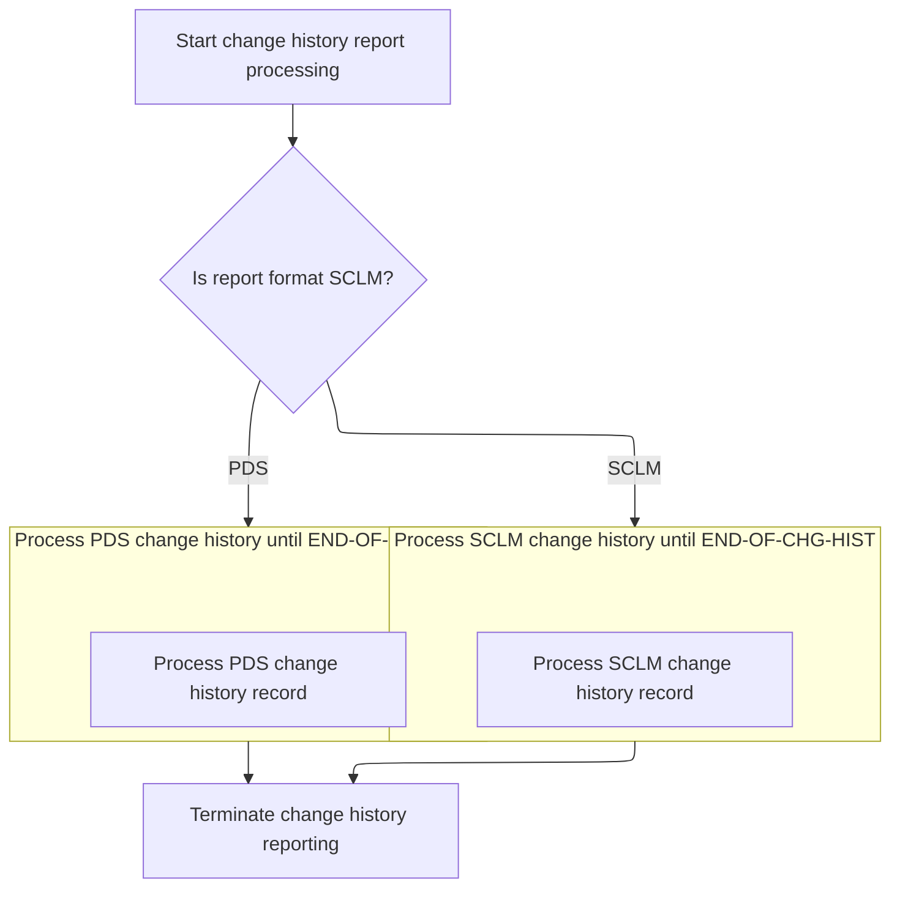

<SwmSnippet path="/PDS/JXC370JX" line="528">

---

After coming back from <SwmToken path="PDS/JXC370JX" pos="532:3:9" line-data="              PERFORM C0300-PROCESS-CHG-PDS  THRU C0300-EXIT">`C0300-PROCESS-CHG-PDS`</SwmToken>, <SwmToken path="PDS/JXC370JX" pos="461:3:9" line-data="           PERFORM C0100-CHG-HIST-REPORTS THRU C0100-EXIT.">`C0100-CHG-HIST-REPORTS`</SwmToken> calls <SwmToken path="PDS/JXC370JX" pos="536:3:9" line-data="           PERFORM C0900-TERMINATE-CHANGE-HISTORY THRU C0900-EXIT.">`C0900-TERMINATE-CHANGE-HISTORY`</SwmToken> to print summary totals, list library names, add a footer if there are pages, and close out the files. This wraps up the reporting and cleans up resources.

```
           IF RR-SCLM-FORMAT
              PERFORM C0200-PROCESS-CHG-SCLM THRU C0200-EXIT
                  UNTIL END-OF-CHG-HIST
           ELSE
              PERFORM C0300-PROCESS-CHG-PDS  THRU C0300-EXIT
                  UNTIL END-OF-CHG-HIST
           END-IF.

           PERFORM C0900-TERMINATE-CHANGE-HISTORY THRU C0900-EXIT.
```

---

</SwmSnippet>

# Finalizing and Closing the Report

This section ensures that the change history report is complete and provides users with both summary statistics and context about which libraries were affected by the changes.

| Category       | Rule Name                   | Description                                                                                                                               |
| -------------- | --------------------------- | ----------------------------------------------------------------------------------------------------------------------------------------- |
| Business logic | Summary Totals First        | The report must include summary totals for all change types (added, changed, deleted) before listing library names.                       |
| Business logic | Library Names Listing       | All library names involved in the changes must be listed in the report to provide context for the summary statistics.                     |
| Business logic | Report Formatting Standards | The report must include appropriate headers and page breaks when listing library names to ensure readability and professional formatting. |

<SwmSnippet path="/PDS/JXC370JX" line="749">

---

In <SwmToken path="PDS/JXC370JX" pos="749:1:7" line-data="       C0900-TERMINATE-CHANGE-HISTORY.">`C0900-TERMINATE-CHANGE-HISTORY`</SwmToken>, we first print the summary totals, then call <SwmToken path="PDS/JXC370JX" pos="754:3:9" line-data="           PERFORM C0920-PRINT-LIB-NAME">`C0920-PRINT-LIB-NAME`</SwmToken> to list all the library names in the report. This gives context to the change stats and helps users see which libraries were involved.

```
       C0900-TERMINATE-CHANGE-HISTORY.

           PERFORM C0910-PRINT-TOTALS
              THRU C0910-EXIT.

           PERFORM C0920-PRINT-LIB-NAME
              THRU C0920-EXIT.
```

---

</SwmSnippet>

## Listing Library Names in the Report

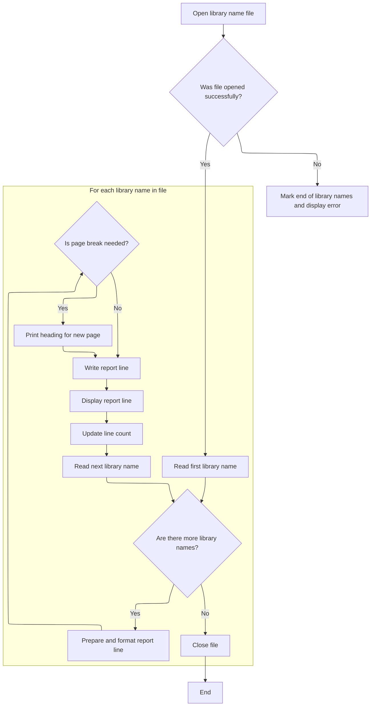

This section is responsible for generating a formatted, paginated report of all library names found in the input file. It ensures that the report is complete, correctly formatted, and includes error handling for file access issues.

| Category       | Rule Name              | Description                                                                                                                                                                                                                                                                                                             |
| -------------- | ---------------------- | ----------------------------------------------------------------------------------------------------------------------------------------------------------------------------------------------------------------------------------------------------------------------------------------------------------------------- |
| Business logic | Library name inclusion | Each library name from the file must be included in the report, formatted according to the report line structure, and displayed to the user.                                                                                                                                                                            |
| Business logic | Pagination enforcement | A new page heading must be printed whenever the number of lines in the report exceeds the maximum lines per page, as defined by the installation constant (<SwmToken path="PDS/JXC370JX" pos="624:11:17" line-data="           IF RPT-LINE-CNT &gt; INST-LINES-PER-PAGE">`INST-LINES-PER-PAGE`</SwmToken>, default 59). |

<SwmSnippet path="/PDS/JXC370JX" line="826">

---

In <SwmToken path="PDS/JXC370JX" pos="826:1:7" line-data="       C0920-PRINT-LIB-NAME.">`C0920-PRINT-LIB-NAME`</SwmToken>, we open the library name file and check the status. If it's not '00' or '97', we log an error and skip the listing. Otherwise, we start reading and printing library names, handling pagination and formatting as we go. The logic assumes the line count and end-of-file flags are set up right from earlier.

```
       C0920-PRINT-LIB-NAME.

           OPEN INPUT LIBRARY-NAME-FILE.

           IF LIB-NAME-STATUS NOT = '00' AND '97'
               DISPLAY '   BAD OPEN ON LIBRARY-NAME'
                       ' FILE. STATUS = '
                       LIB-NAME-STATUS
               MOVE 'Y' TO END-OF-LIBNAME-SW
           ELSE
               PERFORM X0300-READ-LIB-NAME  THRU X0300-EXIT
           END-IF.
```

---

</SwmSnippet>

<SwmSnippet path="/PDS/JXC370JX" line="839">

---

We check if we're about to overflow the page and call the heading routine if needed, so the library name section stays paginated right.

```
           IF NOT END-OF-LIBNAME
              MOVE SPACE TO RPT01-CROSS-REF-LINE
              DISPLAY ' '
              DISPLAY ' '

              ADD  8 TO RPT-LINE-CNT
              IF RPT-LINE-CNT > INST-LINES-PER-PAGE
                 SUBTRACT  8 FROM    RPT-LINE-CNT
                 PERFORM Y0110-SCHEDHST-RPT01-HEADING
                    THRU Y0110-EXIT
              ELSE
                 SUBTRACT  8 FROM    RPT-LINE-CNT
                 WRITE CHANGE-HIST-RPTREC FROM RPT01-CROSS-REF-LINE
                     AFTER ADVANCING 3 LINE
                 ADD 3 TO RPT-LINE-CNT
              END-IF
           END-IF.
```

---

</SwmSnippet>

<SwmSnippet path="/PDS/JXC370JX" line="857">

---

We loop and print all library names, handling page breaks, then close the file at the end.

```
           MOVE SPACE TO RPT01-CROSS-REF-LINE.

           PERFORM UNTIL END-OF-LIBNAME
              IF RPT-LINE-CNT > INST-LINES-PER-PAGE
                  PERFORM Y0110-SCHEDHST-RPT01-HEADING
                     THRU Y0110-EXIT
              END-IF
              MOVE LIB-CROSS-REF    TO RPT01X-LIBRARY-NAME
              WRITE CHANGE-HIST-RPTREC FROM RPT01-CROSS-REF-LINE
                  AFTER ADVANCING 1 LINE
              ADD 1 TO RPT-LINE-CNT
              DISPLAY  RPT01-CROSS-REF-LINE
              PERFORM X0300-READ-LIB-NAME  THRU X0300-EXIT
           END-PERFORM.


           CLOSE LIBRARY-NAME-FILE.
```

---

</SwmSnippet>

## Adding Report Footer and Closing Files

<SwmSnippet path="/PDS/JXC370JX" line="758">

---

After coming back from <SwmToken path="PDS/JXC370JX" pos="754:3:9" line-data="           PERFORM C0920-PRINT-LIB-NAME">`C0920-PRINT-LIB-NAME`</SwmToken>, <SwmToken path="PDS/JXC370JX" pos="536:3:9" line-data="           PERFORM C0900-TERMINATE-CHANGE-HISTORY THRU C0900-EXIT.">`C0900-TERMINATE-CHANGE-HISTORY`</SwmToken> adds a footer if there were any pages, then closes the change history and report files. This wraps up the report formatting and cleans up resources.

```
           IF RPT-PAGE-CNT > 0
               PERFORM Y0120-RPT01-FOOTER THRU Y0120-EXIT.

           CLOSE CHANGE-HISTORY-FILE
                 CHANGE-HISTORY-RPT.
```

---

</SwmSnippet>

&nbsp;

*This is an auto-generated document by Swimm 🌊 and has not yet been verified by a human*

<SwmMeta version="3.0.0" repo-id="Z2l0aHViJTNBJTNBRWFzeXRyaWV2ZS1DQlQ3MjElM0ElM0FtdWRhc2luMQ==" repo-name="Easytrieve-CBT721"><sup>Powered by [Swimm](https://app.swimm.io/)</sup></SwmMeta>
